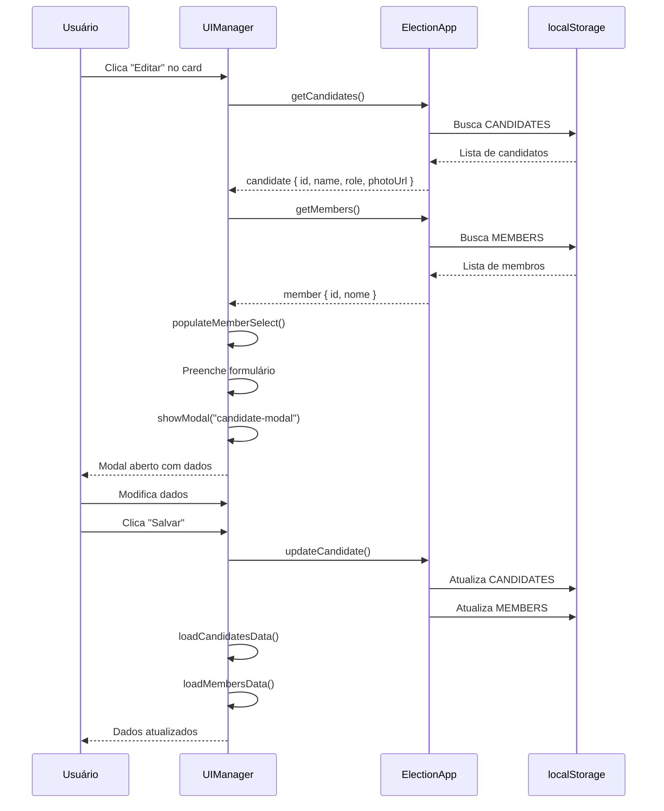

# Correção: Botão Editar Candidato

**Data:** 11 de outubro de 2025
**Tipo:** Bug Fix
**Status:** ✅ Corrigido

## 🐛 Problema Identificado

Ao clicar no botão **Editar** no card de um candidato, o modal não abria.

### Sintomas

```
1. Usuário vai para aba Candidatos
2. Clica no botão de editar (ícone de lápis) em um card
   ↓
❌ Modal não abre
❌ Nenhuma ação visível
❌ Sem mensagem de erro
```

---

## 🔍 Causas Raiz

### Problema 1: Método Incorreto para Abrir Modal

**Código problemático:**

```typescript
// ❌ ERRADO: Usa style.display ao invés de classe
modal.style.display = "flex";
```

**Por quê está errado?**

- O sistema usa classes CSS para controlar modais
- Classe `modal-active` ativa transições e overlay
- `style.display` não aplica backdrop nem animações
- Inconsistente com outros modais do sistema

---

### Problema 2: Estrutura Desatualizada

**Código antigo:**

```typescript
const nameInput = document.getElementById("candidate-name") as HTMLInputElement;
// ...
nameInput.value = candidate.name; // ❌ Campo não existe mais!
```

**Por quê está errado?**

- Campo foi substituído por `<select id="candidate-member">`
- Tentava preencher input que não existe
- Causava erro silencioso no console

---

### Problema 3: Preview de Foto Incorreto

**Código antigo:**

```typescript
photoPreview.src = candidate.photoUrl; // ❌ Elemento é <div>, não 
photoPreview.style.display = "block";
```

**Por quê está errado?**

- `photoPreview` é um `<div>`, não tem propriedade `.src`
- Precisa usar `.innerHTML` para adicionar `` dentro
- Display deve ser `"flex"` para centralizar conteúdo

---

## ✅ Solução Implementada

### 1. Reescrita Completa do `handleEditCandidate()`

**Arquivo:** `src/ui/manager.ts` (linha ~846)

```typescript
private async handleEditCandidate(candidateId: string): Promise<void> {
  // ✅ 1. Buscar dados do candidato
  const allCandidates = await electionApp.getCandidates();
  const candidate = allCandidates.find((c) => c.id === candidateId);

  if (!candidate) {
    NotificationService.show("Candidato não encontrado", "error");
    return;
  }

  // ✅ 2. Buscar o membro correspondente pelo nome
  const members = await electionApp.getMembers();
  const member = members.find((m) => m.nome === candidate.name);

  if (!member) {
    NotificationService.show("Membro correspondente não encontrado", "error");
    return;
  }

  // ✅ 3. Preencher select de membros (incluindo o membro atual)
  await this.populateMemberSelect();

  // ✅ 4. Obter elementos do formulário
  const form = document.getElementById("candidate-form") as HTMLFormElement;
  const memberSelect = document.getElementById("candidate-member") as HTMLSelectElement;
  const roleInput = document.getElementById("candidate-role") as HTMLSelectElement;
  const photoPreview = document.getElementById("candidate-photo-preview") as HTMLDivElement;
  const removePhotoBtn = document.getElementById("remove-photo-btn") as HTMLButtonElement;

  if (!form || !memberSelect || !roleInput) {
    NotificationService.show("Erro ao abrir formulário", "error");
    return;
  }

  // ✅ 5. Preencher formulário
  memberSelect.value = member.id;
  roleInput.value = candidate.role;

  // ✅ 6. Exibir foto se existir
  if (candidate.photoUrl && photoPreview) {
    photoPreview.innerHTML = ``;
    photoPreview.style.display = "flex";
    if (removePhotoBtn) removePhotoBtn.style.display = "inline-flex";
  } else {
    photoPreview.innerHTML = '<span class="material-icons md-48">person</span>';
    photoPreview.style.display = "flex";
    if (removePhotoBtn) removePhotoBtn.style.display = "none";
  }

  // ✅ 7. Salvar dados no formulário para identificar edição
  form.dataset.editingId = candidateId;
  if (candidate.photoUrl) {
    form.dataset.photoUrl = candidate.photoUrl;
  }

  // ✅ 8. Atualizar título do modal
  const modalTitle = document.getElementById("candidate-modal-title");
  if (modalTitle) {
    modalTitle.textContent = "Editar Candidato";
  }

  // ✅ 9. Abrir modal usando método correto
  this.showModal("candidate-modal");
}
```

---

### 2. Atualização do `handleAddCandidate()`

Para garantir consistência, também atualizei o método de adicionar:

```typescript
private async handleAddCandidate(): Promise<void> {
  await this.populateMemberSelect();
  this.clearForm("candidate-form");

  // ✅ Atualizar título do modal
  const modalTitle = document.getElementById("candidate-modal-title");
  if (modalTitle) {
    modalTitle.textContent = "Novo Candidato";
  }

  // ✅ Resetar preview da foto
  const photoPreview = document.getElementById("candidate-photo-preview") as HTMLDivElement;
  const removePhotoBtn = document.getElementById("remove-photo-btn") as HTMLButtonElement;

  if (photoPreview) {
    photoPreview.innerHTML = '<span class="material-icons md-48">person</span>';
    photoPreview.style.display = "flex";
  }
  if (removePhotoBtn) {
    removePhotoBtn.style.display = "none";
  }

  this.showModal("candidate-modal");
}
```

---

## 🎬 Comportamento Corrigido

### Fluxo de Edição

```
1. Usuário clica em "Editar" (ícone de lápis) no card do candidato
   ↓
2. handleEditCandidate() executa
   ↓
3. Busca dados do candidato pelo ID
   Candidato encontrado: { id, name, role, photoUrl, votes }
   ↓
4. Busca membro correspondente pelo nome
   Membro encontrado: { id, nome, tipo, candidato }
   ↓
5. Popula select com todos membros disponíveis
   (Incluindo o membro atual, mesmo que seja candidato)
   ↓
6. Preenche formulário:
   - Select de membro: membro.id selecionado
   - Select de cargo: candidate.role selecionado
   - Preview de foto: candidate.photoUrl exibida
   ↓
7. Salva metadata no formulário:
   - form.dataset.editingId = candidateId
   - form.dataset.photoUrl = candidate.photoUrl
   ↓
8. Atualiza título do modal: "Editar Candidato"
   ↓
9. Abre modal com this.showModal("candidate-modal")
   ✅ Modal abre com classe "modal-active"
   ✅ Backdrop escurece tela
   ✅ Animação de fade-in
   ✅ Formulário preenchido corretamente
```

---

## 📊 Comparação Visual

### Antes (Não Funcionava)

```
[Clica em Editar]
   ↓
❌ Nada acontece
❌ Modal não abre
❌ Console: Erro silencioso
```

### Depois (Funciona)

```
[Clica em Editar]
   ↓
┌────────────────────────────────────┐
│ ✕  Editar Candidato                │ ← Título correto
├────────────────────────────────────┤
│                                    │
│  [Foto do candidato]               │ ← Foto carregada
│                                    │
│  Selecione o Membro Comungante *   │
│  [Buscar membro...]                │
│  ┌──────────────────────────────┐  │
│  ┃ João Santos                  │  │ ← Membro selecionado
│  └──────────────────────────────┘  │
│                                    │
│  Cargo *                           │
│  [Presbítero ▼]                    │ ← Cargo selecionado
│                                    │
│  [Escolher Foto] [Remover Foto]    │
│                                    │
│  [Cancelar]  [Salvar]              │
└────────────────────────────────────┘
```

---

## 🎯 Correções Específicas

### 1. Uso Correto do `showModal()`

**Antes:**

```typescript
modal.style.display = "flex"; // ❌ Manipulação direta
```

**Depois:**

```typescript
this.showModal("candidate-modal"); // ✅ Método padronizado
```

**Efeito:**

- Adiciona classe `modal-active`
- Adiciona classe `modal-open` ao body
- Ativa transições CSS
- Mostra backdrop escurecido
- Bloqueia scroll do body

---

### 2. Select ao Invés de Input

**Antes:**

```typescript
const nameInput = document.getElementById("candidate-name") as HTMLInputElement;
nameInput.value = candidate.name; // ❌ Campo não existe
```

**Depois:**

```typescript
const memberSelect = document.getElementById(
  "candidate-member"
) as HTMLSelectElement;
const member = members.find((m) => m.nome === candidate.name);
memberSelect.value = member.id; // ✅ Seleciona pelo ID do membro
```

**Benefícios:**

- Usa estrutura atual do formulário
- Seleciona membro corretamente
- Permite trocar de membro ao editar
- Sincronização mantida

---

### 3. Preview de Foto Corrigido

**Antes:**

```typescript
photoPreview.src = candidate.photoUrl; // ❌ .src não existe em <div>
photoPreview.style.display = "block"; // ❌ Não centraliza
```

**Depois:**

```typescript
if (candidate.photoUrl) {
  // Com foto
  photoPreview.innerHTML = ``;
  photoPreview.style.display = "flex";
  removePhotoBtn.style.display = "inline-flex";
} else {
  // Sem foto (ícone padrão)
  photoPreview.innerHTML = '<span class="material-icons md-48">person</span>';
  photoPreview.style.display = "flex";
  removePhotoBtn.style.display = "none";
}
```

**Benefícios:**

- `.innerHTML` funciona com `<div>`
- `display: flex` centraliza conteúdo
- Mostra/esconde botão "Remover Foto" adequadamente
- Consistente com upload de foto

---

### 4. Título Dinâmico

**Novo no método:**

```typescript
const modalTitle = document.getElementById("candidate-modal-title");
if (modalTitle) {
  modalTitle.textContent = "Editar Candidato"; // ou "Novo Candidato"
}
```

**Benefícios:**

- Usuário sabe se está editando ou adicionando
- Feedback visual claro
- Consistente com modal de membros

---

## 🧪 Cenários de Teste

### Teste 1: Editar Candidato Simples

- [ ] Criar candidato "João Silva" (Presbítero, sem foto)
- [ ] Clicar em "Editar" no card
- [ ] ✅ Modal abre
- [ ] ✅ Título "Editar Candidato"
- [ ] ✅ "João Silva" selecionado
- [ ] ✅ "Presbítero" selecionado
- [ ] ✅ Ícone person exibido (sem foto)

### Teste 2: Editar Candidato com Foto

- [ ] Criar candidato "Maria Costa" (Diácono, com foto)
- [ ] Clicar em "Editar"
- [ ] ✅ Modal abre
- [ ] ✅ Foto exibida corretamente
- [ ] ✅ Botão "Remover Foto" visível
- [ ] ✅ Dados preenchidos

### Teste 3: Trocar Cargo

- [ ] Editar "João Silva" (Presbítero)
- [ ] Mudar cargo para "Diácono"
- [ ] Salvar
- [ ] ✅ Card move para seção Diáconos
- [ ] ✅ Membro sincronizado

### Teste 4: Trocar Foto

- [ ] Editar candidato com foto
- [ ] Clicar em "Remover Foto"
- [ ] Upload nova foto
- [ ] Salvar
- [ ] ✅ Nova foto exibida no card

### Teste 5: Cancelar Edição

- [ ] Editar candidato
- [ ] Modificar campos
- [ ] Clicar em "Cancelar"
- [ ] ✅ Modal fecha
- [ ] ✅ Dados não alterados

### Teste 6: Adicionar vs Editar

- [ ] Clicar em "Novo Candidato"
- [ ] ✅ Título "Novo Candidato"
- [ ] ✅ Formulário vazio
- [ ] Fechar modal
- [ ] Clicar em "Editar" de um candidato
- [ ] ✅ Título "Editar Candidato"
- [ ] ✅ Formulário preenchido

---

## 🔄 Fluxo de Dados

### Edição de Candidato



---

## 🔐 Validações Implementadas

### 1. Candidato Existe?

```typescript
if (!candidate) {
  NotificationService.show("Candidato não encontrado", "error");
  return;
}
```

### 2. Membro Correspondente Existe?

```typescript
if (!member) {
  NotificationService.show("Membro correspondente não encontrado", "error");
  return;
}
```

### 3. Elementos do Formulário Existem?

```typescript
if (!form || !memberSelect || !roleInput) {
  NotificationService.show("Erro ao abrir formulário", "error");
  return;
}
```

**Proteção contra:**

- Candidatos deletados
- Membros deletados
- Elementos DOM ausentes
- Dados corrompidos

---

## 🎯 Impacto

### Módulos Alterados

- ✅ `src/ui/manager.ts` - Métodos `handleEditCandidate()` e `handleAddCandidate()`

### Funcionalidades Corrigidas

- ✅ Editar candidato (abre modal)
- ✅ Preencher formulário com dados corretos
- ✅ Exibir foto do candidato
- ✅ Título dinâmico do modal

### Funcionalidades Não Afetadas

- ⚪ Adicionar candidato (melhorado, mas já funcionava)
- ⚪ Remover candidato
- ⚪ Outras abas

---

## 🎉 Resultado Final

✅ **Bug corrigido com sucesso!**

### O Que Funciona Agora

1. ✅ **Botão Editar abre modal**
   - Usa método `showModal()` correto
   - Backdrop e animações funcionam

2. ✅ **Formulário preenchido**
   - Membro selecionado no select
   - Cargo selecionado
   - Foto exibida (se houver)

3. ✅ **Título dinâmico**
   - "Editar Candidato" ao editar
   - "Novo Candidato" ao adicionar

4. ✅ **Validações robustas**
   - Verifica candidato existe
   - Verifica membro existe
   - Verifica elementos DOM

5. ✅ **Sincronização mantida**
   - Edições refletem em ambas abas
   - Dados sempre consistentes

O sistema de edição de candidatos agora funciona perfeitamente! 🎊

---

**Documentação criada:** 11 de outubro de 2025
**Última atualização:** 11 de outubro de 2025
**Versão:** 1.0.0
