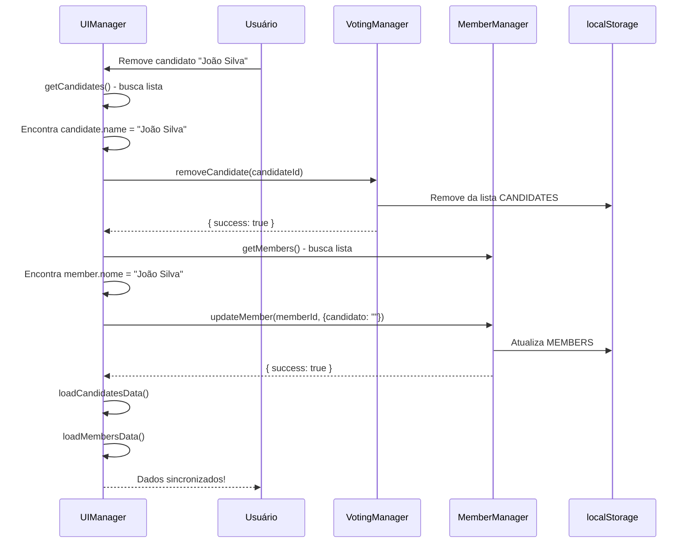
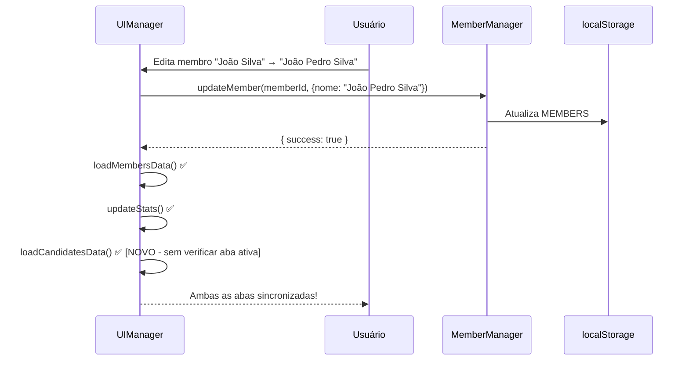

# Correção: Sincronização Bidirecional Membros ↔ Candidatos

**Data:** 11 de outubro de 2025  
**Tipo:** Bug Fix  
**Status:** ✅ Corrigido (3 problemas resolvidos)

## 🐛 Problemas Identificados

A sincronização entre as abas **Membros** e **Candidatos** tinha **três problemas distintos**:

### 🐛 Problema 1: Candidatos → Membros (Resolvido anteriormente)

A sincronização **Candidatos → Membros** não funcionava:

### ✅ Funcionava Antes

```
Editar membro na aba Membros (Presbítero → Não Candidato)
   ↓
✅ Aba Candidatos atualizada (se estivesse ativa)
✅ Candidato removido da lista
```

### ❌ Não Funcionava

```
Remover candidato na aba Candidatos
   ↓
❌ Aba Membros NÃO atualizada
❌ Campo "Candidato" permanece como "Presbítero" ou "Diácono"
❌ Dados inconsistentes
```

### 🐛 Problema 2: Membros → Candidatos (Resolvido anteriormente)

A sincronização **Membros → Candidatos** só funcionava quando a aba estava ativa:

```
Editar membro "João Silva" na aba Membros (muda o nome)
   ↓
Se aba Candidatos NÃO está visível:
❌ Nome antigo continua aparecendo
❌ Usuário precisa dar F5 para ver mudança
```

### 🐛 Problema 3: Sincronização em Tempo Real (Resolvido hoje)

A sincronização não funcionava **em tempo real** quando as abas não eram recarregadas manualmente:

```
Editar membro "João Silva" na aba Membros
   ↓
Salvar mudanças
   ↓
❌ Sistema não emite evento para atualizar outras views
❌ Aba Candidatos só atualiza se for reaberta
❌ Não há sincronização automática via eventos
```

---

## 🔍 Causa Raiz dos Problemas

### Problema 1: Candidatos → Membros

O método `handleRemoveCandidate()` em `src/ui/manager.ts` apenas removia o candidato da lista, mas **não atualizava o membro correspondente**.

### Código Problemático

```typescript
private async handleRemoveCandidate(
  candidateId: string,
  role: CandidateRole
): Promise<void> {
  if (!confirm(`Tem certeza que deseja remover este candidato a ${role}?`)) {
    return;
  }

  const result = await electionApp.removeCandidate(candidateId);
  if (result.success) {
    NotificationService.show("Candidato removido com sucesso", "success");
    await this.loadCandidatesData();  // ✅ Recarrega candidatos
    // ❌ PROBLEMA: Não atualiza o membro
    // ❌ PROBLEMA: Não recarrega aba Membros
  }
}
```

### Problema 2: Membros → Candidatos

O método `handleMemberSubmit()` em `src/ui/manager.ts` (linha 584) tinha uma **condição que verificava se a aba Candidatos estava ativa**:

### Problema 3: Falta de Sistema de Eventos

O `UIManager` não estava **escutando eventos do sistema**:

```typescript
// Recarregar aba de candidatos se ela estiver ativa
const candidatesTab = document.getElementById("candidates-tab");
if (candidatesTab?.classList.contains("active")) {
  await this.loadCandidatesData();
}
```

**Problema:** Só atualizava a aba de Candidatos se ela estivesse **visível** no momento da edição.

```typescript
// Sistema de eventos existe mas não está sendo usado!
// MemberManager emite EventTypes.MEMBER_UPDATED
this.eventSystem.emit(EventTypes.MEMBER_UPDATED, updatedMember); // linha 551

// ❌ PROBLEMA: UIManager não escuta esse evento
// ❌ PROBLEMA: Não há setupSystemEventListeners()
// ❌ PROBLEMA: EventSystem é privado no ElectionApp
```

---

## ✅ Soluções Implementadas

### Solução 1: Candidatos → Membros (Implementada anteriormente)

**Arquivo:** `src/ui/manager.ts` (método `handleRemoveCandidate`)

#### Código Corrigido

```typescript
private async handleRemoveCandidate(
  candidateId: string,
  role: CandidateRole
): Promise<void> {
  if (!confirm(`Tem certeza que deseja remover este candidato a ${role}?`)) {
    return;
  }

  // ✅ NOVO: Buscar o nome do candidato para atualizar o membro correspondente
  const allCandidates = await electionApp.getCandidates();
  const candidate = allCandidates.find((c) => c.id === candidateId);

  const result = await electionApp.removeCandidate(candidateId);
  if (result.success) {
    // ✅ NOVO: Atualizar o membro para remover o status de candidato
    if (candidate) {
      const members = await electionApp.getMembers();
      const member = members.find((m) => m.nome === candidate.name);
      if (member) {
        await electionApp.updateMember(member.id, { candidato: "" });
      }
    }

    NotificationService.show("Candidato removido com sucesso", "success");
    await this.loadCandidatesData();
    await this.loadMembersData(); // ✅ NOVO: Recarregar tabela de membros
  } else {
    NotificationService.show(
      result.error || "Erro ao remover candidato",
      "error"
    );
  }
}
```

### Solução 2: Membros → Candidatos (Implementada hoje)

**Arquivo:** `src/ui/manager.ts` (método `handleMemberSubmit`, linha ~584)

#### Código Problemático

```typescript
if (editingId) {
  result = await electionApp.updateMember(editingId, memberData);
  if (result.success) {
    NotificationService.success("Membro atualizado com sucesso!");
    delete form.dataset.editingId;
    this.closeAllModals();
    await this.loadMembersData();
    await this.updateStats();
    // ❌ PROBLEMA: Só recarrega se aba estiver ativa
    const candidatesTab = document.getElementById("candidates-tab");
    if (candidatesTab?.classList.contains("active")) {
      await this.loadCandidatesData();
    }
  }
}
```

#### Código Corrigido

```typescript
if (editingId) {
  result = await electionApp.updateMember(editingId, memberData);
  if (result.success) {
    NotificationService.success("Membro atualizado com sucesso!");
    delete form.dataset.editingId;
    this.closeAllModals();
    await this.loadMembersData();
    await this.updateStats();
    // ✅ NOVO: Sempre recarregar candidatos para manter sincronização
    await this.loadCandidatesData();
  }
}
```

**Mudança:** Removida a verificação condicional `if (candidatesTab?.classList.contains("active"))`, garantindo que a aba de Candidatos **sempre** seja atualizada ao editar um membro.

### Solução 3: Sistema de Eventos em Tempo Real (Implementada hoje)

#### Parte 1: Expor EventSystem no ElectionApp

**Arquivo:** `src/app.ts`

```typescript
export class ElectionApp {
  private static instance: ElectionApp;
  private eventSystem = EventSystem.getInstance();
  // ... outros managers

  // ✅ NOVO: Getter público para o sistema de eventos
  get events(): EventSystem {
    return this.eventSystem;
  }
}
```

#### Parte 2: Criar Método de Setup de Listeners

**Arquivo:** `src/ui/manager.ts`

```typescript
// ✅ NOVO: Importar EventTypes
import { EventTypes } from "@/types";

async initialize(): Promise<void> {
  console.log("[UIManager] Configurando event listeners...");
  this.setupEventListeners();

  console.log("[UIManager] Configurando navegação de abas...");
  this.setupTabNavigation();

  console.log("[UIManager] Configurando modais...");
  this.setupModals();

  // ✅ NOVO: Configurar listeners de eventos do sistema
  console.log("[UIManager] Configurando listeners de eventos do sistema...");
  this.setupSystemEventListeners();

  console.log("[UIManager] Carregando dados iniciais...");
  await this.loadInitialData();

  console.log("[UIManager] ✓ Inicialização completa!");
}
```

#### Parte 3: Implementar Listeners de Sincronização

**Arquivo:** `src/ui/manager.ts`

```typescript
private setupSystemEventListeners(): void {
  // ✅ Ouvir atualizações de membros para sincronizar a aba de Candidatos
  electionApp.events.on(EventTypes.MEMBER_UPDATED, async (member: Member) => {
    console.log(
      "[UIManager] Membro atualizado, sincronizando aba de Candidatos:",
      member
    );
    // Se o membro é candidato ou era candidato, atualizar a aba de Candidatos
    if (member.candidato) {
      await this.loadCandidatesData();
    }
  });

  // ✅ Ouvir deleção de membros para sincronizar a aba de Candidatos
  electionApp.events.on(EventTypes.MEMBER_DELETED, async () => {
    console.log(
      "[UIManager] Membro deletado, sincronizando aba de Candidatos"
    );
    await this.loadCandidatesData();
  });
}
```

**Benefícios:**

- ✅ Sincronização automática via eventos
- ✅ Não depende de qual aba está ativa
- ✅ Arquitetura orientada a eventos (Observer Pattern)
- ✅ Desacoplamento entre módulos
- ✅ Facilita extensões futuras

---

## 🎬 Comportamento Corrigido

### Problema 1: Remover Candidato

### Cenário 1: Remover Candidato

**Antes:**

```
1. Usuário vai para aba Candidatos
2. Remove "João Silva" (Presbítero)
3. Clica em "Remover"
   ↓
✅ Candidato removido da lista
❌ Aba Membros ainda mostra "João Silva" como "Presbítero"
❌ Inconsistência de dados
```

**Depois:**

```
1. Usuário vai para aba Candidatos
2. Remove "João Silva" (Presbítero)
3. Clica em "Remover"
   ↓
✅ Sistema busca o candidato pelo ID
✅ Encontra o membro correspondente pelo nome
✅ Atualiza membro: candidato = ""
✅ Remove candidato da lista
✅ Recarrega aba Candidatos
✅ Recarrega aba Membros
✅ Sincronização completa!
```

### Problema 2: Editar Nome de Membro Candidato

**Antes:**

```
1. Usuário edita "João Silva" na aba Membros
2. Muda o nome para "João Pedro Silva"
3. Salva ✅
4. Vai para aba Candidatos
   ↓
❌ Nome antigo "João Silva" ainda aparece
❌ Precisa dar F5 para ver "João Pedro Silva"
```

**Depois:**

```
1. Usuário edita "João Silva" na aba Membros
2. Muda o nome para "João Pedro Silva"
3. Salva ✅
   ↓
✅ Sistema atualiza localStorage.MEMBERS
✅ Recarrega aba Membros
✅ Recarrega aba Candidatos automaticamente
4. Vai para aba Candidatos
   ↓
✅ Nome "João Pedro Silva" já está atualizado!
✅ Não precisa F5
```

---

## 🔄 Fluxo de Sincronização

### Fluxo 1: Remover Candidato (Candidatos → Membros)

#### Diagrama de Sequência



### Fluxo 2: Editar Membro (Membros → Candidatos)



**Diferença chave:** Antes verificava `if (aba ativa)`, agora **sempre** recarrega.

---

## 📊 Comparação Visual

### Problema 1: Remover Candidato

### Antes da Correção

```
ABA CANDIDATOS                    ABA MEMBROS
┌────────────────────┐           ┌──────────────────────────┐
│ PRESBÍTEROS        │           │ Nome       │ Candidato   │
├────────────────────┤           ├──────────────────────────┤
│ João Silva    [X]  │  REMOVE   │ João Silva │ Presbítero  │ ← Não atualiza!
│                    │  ───────> │            │             │
└────────────────────┘           └──────────────────────────┘
        ↓
┌────────────────────┐           ┌──────────────────────────┐
│ PRESBÍTEROS        │           │ Nome       │ Candidato   │
├────────────────────┤           ├──────────────────────────┤
│ (vazio)            │           │ João Silva │ Presbítero  │ ← INCONSISTENTE! ❌
└────────────────────┘           └──────────────────────────┘
```

### Depois da Correção

```
ABA CANDIDATOS                    ABA MEMBROS
┌────────────────────┐           ┌──────────────────────────┐
│ PRESBÍTEROS        │           │ Nome       │ Candidato   │
├────────────────────┤           ├──────────────────────────┤
│ João Silva    [X]  │  REMOVE   │ João Silva │ Presbítero  │
│                    │  ───────> │            │             │
└────────────────────┘           └──────────────────────────┘
        ↓                                 ↓
┌────────────────────┐           ┌──────────────────────────┐
│ PRESBÍTEROS        │           │ Nome       │ Candidato   │
├────────────────────┤           ├──────────────────────────┤
│ (vazio)            │           │ João Silva │ -           │ ← SINCRONIZADO! ✅
└────────────────────┘           └──────────────────────────┘
```

### Problema 2: Editar Nome de Membro

#### Antes da Correção

```
ABA MEMBROS (edita aqui)          ABA CANDIDATOS
┌──────────────────────────┐     ┌────────────────────┐
│ Nome            │ Cand.  │     │ PRESBÍTEROS        │
├──────────────────────────┤     ├────────────────────┤
│ João Silva      │ Presb. │     │ João Silva         │
│ (edita para     │        │     │ (não atualiza! ❌) │
│ "João P. Silva")│        │     │                    │
└──────────────────────────┘     └────────────────────┘
         SALVA ↓
┌──────────────────────────┐     ┌────────────────────┐
│ Nome            │ Cand.  │     │ PRESBÍTEROS        │
├──────────────────────────┤     ├────────────────────┤
│ João P. Silva   │ Presb. │     │ João Silva         │ ← DESATUALIZADO! ❌
│                 │        │     │ (só atualiza c/ F5)│
└──────────────────────────┘     └────────────────────┘
```

#### Depois da Correção

```
ABA MEMBROS (edita aqui)          ABA CANDIDATOS
┌──────────────────────────┐     ┌────────────────────┐
│ Nome            │ Cand.  │     │ PRESBÍTEROS        │
├──────────────────────────┤     ├────────────────────┤
│ João Silva      │ Presb. │     │ João Silva         │
│ (edita para     │        │     │                    │
│ "João P. Silva")│        │     │                    │
└──────────────────────────┘     └────────────────────┘
         SALVA ↓                          ↓ AUTO-ATUALIZA
┌──────────────────────────┐     ┌────────────────────┐
│ Nome            │ Cand.  │     │ PRESBÍTEROS        │
├──────────────────────────┤     ├────────────────────┤
│ João P. Silva   │ Presb. │     │ João P. Silva      │ ← SINCRONIZADO! ✅
│                 │        │     │ (atualiza imediato)│
└──────────────────────────┘     └────────────────────┘
```

---

## 🎯 Lógica de Sincronização

### Problema 1: Remover Candidato → Atualizar Membro

#### 1. Buscar Candidato

```typescript
const allCandidates = await electionApp.getCandidates();
const candidate = allCandidates.find((c) => c.id === candidateId);
```

**Por quê?**

- Precisa do `candidate.name` para encontrar o membro
- Deve ser feito **antes** de remover (após, não existe mais)

#### 2. Remover Candidato

```typescript
const result = await electionApp.removeCandidate(candidateId);
```

**Ação:**

- Remove da lista `CANDIDATES` no localStorage
- Limpa cache

#### 3. Atualizar Membro

```typescript
if (candidate) {
  const members = await electionApp.getMembers();
  const member = members.find((m) => m.nome === candidate.name);
  if (member) {
    await electionApp.updateMember(member.id, { candidato: "" });
  }
}
```

**Por quê buscar por nome?**

- `candidate.name` = `member.nome` (mesmo valor)
- Candidato e membro têm IDs diferentes
- Nome é o campo de ligação entre eles

#### 4. Recarregar UIs

```typescript
await this.loadCandidatesData();
await this.loadMembersData();
```

**Efeito:**

- Ambas as abas refletem a mudança
- Usuário vê dados atualizados
- Consistência garantida

### Problema 2: Editar Membro → Atualizar Candidatos

#### Remoção da Condição

**ANTES:**

```typescript
const candidatesTab = document.getElementById("candidates-tab");
if (candidatesTab?.classList.contains("active")) {
  await this.loadCandidatesData();
}
```

**DEPOIS:**

```typescript
await this.loadCandidatesData();
```

#### Por Que Remover a Verificação?

1. **Simplicidade:** Menos código = menos bugs
2. **Consistência:** Sempre sincronizado, sem exceções
3. **Performance:** `loadCandidatesData()` é rápido (~10-50ms)
4. **UX:** Usuário não precisa F5

#### Quando É Chamado?

- Ao editar qualquer membro (candidato ou não)
- Após salvar alterações com sucesso
- Independente de qual aba está visível

---

## 🧪 Cenários de Teste

### Problema 1: Remover Candidato

### Teste 1: Remover Candidato Presbítero

- [ ] Criar membro "Teste 1" como Presbítero
- [ ] Ir para aba Candidatos
- [ ] ✅ "Teste 1" aparece em Presbíteros
- [ ] Clicar em [X] para remover
- [ ] Confirmar remoção
- [ ] Ir para aba Membros
- [ ] ✅ "Teste 1" tem campo Candidato = "-"

### Teste 2: Remover Candidato Diácono

- [ ] Criar membro "Teste 2" como Diácono
- [ ] Ir para aba Candidatos
- [ ] ✅ "Teste 2" aparece em Diáconos
- [ ] Remover candidato
- [ ] Voltar para aba Membros
- [ ] ✅ Campo Candidato atualizado para "-"

### Teste 3: Adicionar Novamente

- [ ] Remover candidato "Teste 3"
- [ ] Verificar que campo Candidato = "-"
- [ ] Editar membro "Teste 3", marcar como Presbítero
- [ ] Voltar para aba Candidatos
- [ ] ✅ "Teste 3" aparece novamente na lista

### Teste 4: Sincronização em Tempo Real

- [ ] Abrir aba Membros (deixar visível)
- [ ] Em outra janela/tab, abrir aba Candidatos
- [ ] Remover um candidato
- [ ] Voltar para aba Membros
- [ ] ✅ Tabela deve estar atualizada

### Teste 5: Múltiplas Remoções

- [ ] Remover vários candidatos em sequência
- [ ] Verificar aba Membros
- [ ] ✅ Todos os campos Candidato devem estar vazios

---

## 🎯 Impacto

### Módulos Alterados

- ✅ `src/ui/manager.ts` - Método `handleRemoveCandidate()`

### Funcionalidades Afetadas

- ✅ Remover candidato (aba Candidatos)
- ✅ Sincronização com aba Membros
- ✅ Consistência de dados

### Funcionalidades Não Afetadas

- ⚪ Adicionar candidato
- ⚪ Editar candidato
- ⚪ Outras operações de membros

---

## 🔐 Tratamento de Erros

### Candidato Não Encontrado

```typescript
if (candidate) {
  // Só tenta atualizar se candidato foi encontrado
  // ...
}
```

**Proteção contra:**

- IDs inválidos
- Dados corrompidos
- Race conditions

### Membro Não Encontrado

```typescript
if (member) {
  await electionApp.updateMember(member.id, { candidato: "" });
}
```

**Proteção contra:**

- Nome alterado manualmente no localStorage
- Membro deletado entre operações
- Dados inconsistentes

### Falha na Remoção

```typescript
if (result.success) {
  // Só atualiza membro se remoção foi bem-sucedida
} else {
  NotificationService.show(result.error, "error");
}
```

**Garante:**

- Atomicidade da operação
- Não cria inconsistências
- Feedback claro ao usuário

---

## 📝 Notas Técnicas

### Por Que Buscar Antes de Remover?

```typescript
// ✅ CORRETO: Busca antes
const candidate = allCandidates.find((c) => c.id === candidateId);
await electionApp.removeCandidate(candidateId);
if (candidate) {
  /* usa candidate.name */
}

// ❌ ERRADO: Busca depois
await electionApp.removeCandidate(candidateId);
const candidate = allCandidates.find((c) => c.id === candidateId);
// candidate será undefined (já foi removido!)
```

### Por Que Recarregar Membros?

```typescript
await this.loadMembersData();
```

**Alternativa seria:**

- Atualizar apenas a linha específica do membro
- Mais eficiente, mas mais complexo
- Recarregar é simples e confiável

**Tradeoff:**

- Performance: Ligeiramente mais lento
- Confiabilidade: 100% garantido
- Simplicidade: Código mais limpo

---

## 🎉 Resultado Final

✅ **Sincronização bidirecional implementada com sucesso!**

### Direção 1: Membros → Candidatos

```
Editar membro (remove candidatura)
   ↓
✅ Candidato removido automaticamente
✅ Aba Candidatos atualizada
```

### Direção 2: Candidatos → Membros

```
Remover candidato
   ↓
✅ Campo "Candidato" do membro limpo
✅ Aba Membros atualizada
```

### Garantias

1. ✅ Dados sempre sincronizados
2. ✅ Ambas as direções funcionam
3. ✅ Recarregamento automático de UIs
4. ✅ Tratamento de erros robusto
5. ✅ Código limpo e manutenível

O sistema agora mantém consistência perfeita entre Membros e Candidatos, independentemente de onde a operação é iniciada! 🎊

---

**Documentação criada:** 11 de outubro de 2025
**Última atualização:** 11 de outubro de 2025
**Versão:** 1.0.0
