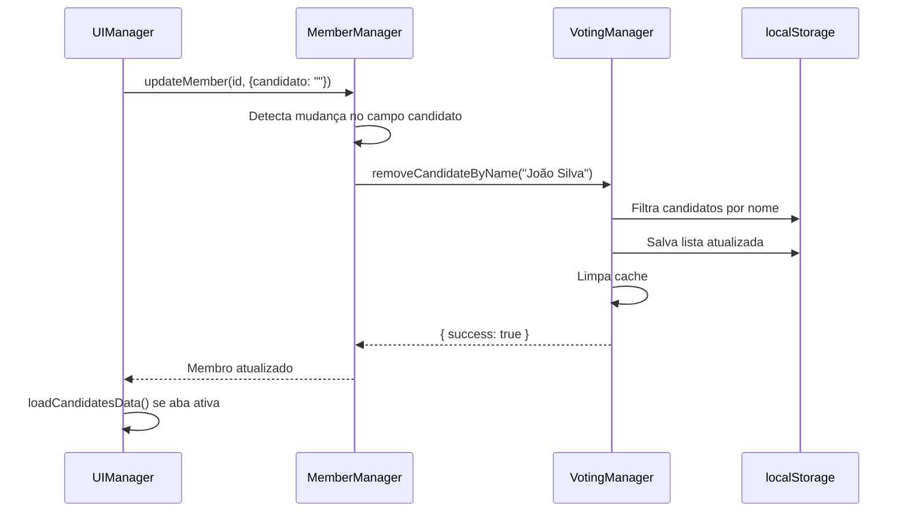
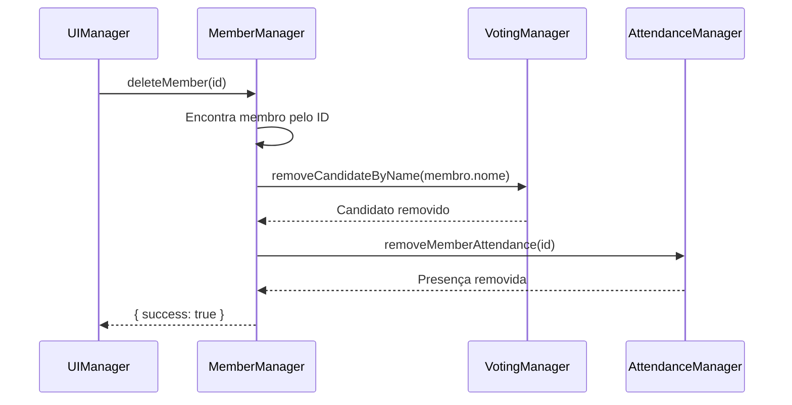

# Correção: Sincronização entre Membros e Candidatos

**Data:** 11 de outubro de 2025
**Tipo:** Bug Fix
**Status:** ✅ Corrigido

## 🐛 Problema Identificado

Ao atualizar o status de candidato de um membro na aba **Membros** (alterando de "Presbítero" ou "Diácono" para "Não Candidato"), o sistema não removia o candidato da aba **Candidatos**.

### Sintomas

```
1. Usuário edita membro "João Silva"
2. Muda campo "Candidato" de "Presbítero" para ""
3. Clica em "Salvar"
   ↓
❌ Membro atualizado na aba Membros
❌ Candidato AINDA aparece na aba Candidatos
❌ Dados inconsistentes entre as abas
```

---

## 🔍 Causa Raiz

O sistema tinha lógica de sincronização implementada, mas estava usando **IDs incompatíveis**:

### Estrutura de IDs

**Membro:**

```typescript
{
  id: "member_123",  // ← ID do membro
  nome: "João Silva",
  candidato: "Presbítero"
}
```

**Candidato:**

```typescript
{
  id: "candidate_abc",  // ← ID diferente (gerado ao criar candidato)
  name: "João Silva",
  role: "Presbítero"
}
```

### Código Problemático

**`src/modules/members.ts` (linha ~508)**

```typescript
// ❌ ERRADO: Tentava remover por ID do membro
if (oldCandidato && !newCandidato) {
  await votingManager.removeCandidate(id); // ← id do MEMBRO
}
```

**`src/modules/voting.ts` (linha ~387)**

```typescript
// Remove candidato por ID
candidatesStorage.presbyteros = candidatesStorage.presbyteros.filter(
  (c: Candidate) => c.id !== id // ← Busca por ID do CANDIDATO
);
```

**Resultado:**

- Busca por `member_123`
- Candidato tem ID `candidate_abc`
- Filtro não encontra → candidato não é removido ❌

---

## ✅ Solução Implementada

### 1. Novo Método: `removeCandidateByName()`

**Arquivo:** `src/modules/voting.ts`

```typescript
async removeCandidateByName(name: string): Promise<AsyncResult<void>> {
  try {
    const stored = localStorage.getItem(StorageKeys.CANDIDATES);
    const candidatesStorage = stored
      ? JSON.parse(stored)
      : { presbyteros: [], diaconos: [] };

    // Remove candidato buscando por NOME (campo único)
    candidatesStorage.presbyteros = candidatesStorage.presbyteros.filter(
      (c: Candidate) => c.name !== name
    );
    candidatesStorage.diaconos = candidatesStorage.diaconos.filter(
      (c: Candidate) => c.name !== name
    );

    localStorage.setItem(
      StorageKeys.CANDIDATES,
      JSON.stringify(candidatesStorage)
    );
    this.candidatesCache.clear();

    return { success: true };
  } catch (error) {
    ErrorHandler.log(error as Error, "VotingManager.removeCandidateByName");
    return {
      success: false,
      error: "Erro interno ao remover candidato",
    };
  }
}
```

**Por quê usar nome?**

- ✅ Campo `name` do candidato = campo `nome` do membro
- ✅ Nome é único no sistema (validado na importação)
- ✅ Sincronização confiável sem necessidade de mapear IDs

---

### 2. Atualização do `MemberManager`

**Arquivo:** `src/modules/members.ts`

#### Método `updateMember()` (linha ~495)

**Antes:**

```typescript
if (oldCandidato && !newCandidato) {
  await votingManager.removeCandidate(id); // ❌ ID do membro
}
```

**Depois:**

```typescript
if (oldCandidato && !newCandidato) {
  await votingManager.removeCandidateByName(updatedMember.nome); // ✅ Nome
}
```

#### Método `deleteMember()` (linha ~568)

**Antes:**

```typescript
if (memberToDelete?.candidato) {
  await votingManager.removeCandidate(id); // ❌ ID do membro
}
```

**Depois:**

```typescript
if (memberToDelete?.candidato) {
  await votingManager.removeCandidateByName(memberToDelete.nome); // ✅ Nome
}
```

---

### 3. Recarregamento da Aba Candidatos

**Arquivo:** `src/ui/manager.ts` (linha ~461)

Adicionado recarregamento automático da aba Candidatos após editar membro:

```typescript
if (editingId) {
  result = await electionApp.updateMember(editingId, memberData);
  if (result.success) {
    NotificationService.success("Membro atualizado com sucesso!");
    delete form.dataset.editingId;
    this.closeAllModals();
    await this.loadMembersData();
    await this.updateStats();

    // ✅ NOVO: Recarregar aba de candidatos se estiver ativa
    const candidatesTab = document.getElementById("candidates-tab");
    if (candidatesTab?.classList.contains("active")) {
      await this.loadCandidatesData();
    }
  }
}
```

**Benefícios:**

- ✅ UI sempre sincronizada
- ✅ Mudanças refletidas instantaneamente
- ✅ Sem necessidade de trocar de aba

---

## 🎬 Comportamento Corrigido

### Cenário 1: Remover Candidatura

```
1. Usuário abre aba Membros
2. Edita "João Silva" (Candidato: Presbítero)
3. Altera campo "Candidato" para ""
4. Clica em "Salvar"
   ↓
✅ Membro atualizado (candidato = "")
✅ Candidato removido da lista (por nome)
✅ Aba Candidatos recarregada automaticamente
✅ "João Silva" não aparece mais como candidato
```

### Cenário 2: Mudar Cargo de Candidato

```
1. Usuário edita "Maria Santos" (Candidato: Diácono)
2. Altera campo "Candidato" para "Presbítero"
3. Clica em "Salvar"
   ↓
✅ Candidato removido da lista de Diáconos (por nome)
✅ Novo candidato adicionado à lista de Presbíteros
✅ Aba Candidatos reflete a mudança
✅ Foto e votos preservados (se houver)
```

### Cenário 3: Excluir Membro Candidato

```
1. Usuário exclui "Pedro Costa" (Candidato: Presbítero)
2. Confirma exclusão
   ↓
✅ Membro removido
✅ Candidato removido da lista (por nome)
✅ Registro de presença removido
✅ Sistema consistente
```

---

## 📊 Comparação Visual

### Antes da Correção

```
┌─────────────────────┐    ┌─────────────────────┐
│   ABA MEMBROS       │    │  ABA CANDIDATOS     │
├─────────────────────┤    ├─────────────────────┤
│ João Silva          │    │ João Silva          │
│ Candidato: -        │    │ Presbítero ❌       │  ← Inconsistente!
├─────────────────────┤    ├─────────────────────┤
│                     │    │                     │
└─────────────────────┘    └─────────────────────┘
```

### Depois da Correção

```
┌─────────────────────┐    ┌─────────────────────┐
│   ABA MEMBROS       │    │  ABA CANDIDATOS     │
├─────────────────────┤    ├─────────────────────┤
│ João Silva          │    │                     │
│ Candidato: -        │    │ (vazio)             │  ← Sincronizado! ✅
├─────────────────────┤    ├─────────────────────┤
│                     │    │                     │
└─────────────────────┘    └─────────────────────┘
```

---

## 🔄 Fluxo de Sincronização

### Atualizar Membro



### Excluir Membro



---

## 🧪 Cenários de Teste

### Teste 1: Remover Candidatura

- [ ] Criar membro "Teste 1" como "Presbítero"
- [ ] Ir para aba Candidatos
- [ ] ✅ "Teste 1" aparece em Presbíteros
- [ ] Voltar para aba Membros
- [ ] Editar "Teste 1", mudar para "Não Candidato"
- [ ] Salvar
- [ ] Voltar para aba Candidatos
- [ ] ✅ "Teste 1" NÃO aparece mais

### Teste 2: Mudar Cargo

- [ ] Criar membro "Teste 2" como "Diácono"
- [ ] Verificar na aba Candidatos (Diáconos)
- [ ] ✅ "Teste 2" aparece
- [ ] Editar "Teste 2", mudar para "Presbítero"
- [ ] Salvar
- [ ] ✅ "Teste 2" aparece em Presbíteros
- [ ] ✅ "Teste 2" NÃO aparece em Diáconos

### Teste 3: Excluir Candidato

- [ ] Criar membro "Teste 3" como "Presbítero"
- [ ] Verificar na aba Candidatos
- [ ] Excluir "Teste 3" na aba Membros
- [ ] Voltar para aba Candidatos
- [ ] ✅ "Teste 3" NÃO aparece

### Teste 4: Sincronização em Tempo Real

- [ ] Abrir aba Candidatos (deixar visível)
- [ ] Voltar para aba Membros
- [ ] Editar um candidato qualquer
- [ ] Mudar status para "Não Candidato"
- [ ] Salvar
- [ ] ✅ Aba Candidatos deve recarregar automaticamente

---

## 🎯 Impacto

### Módulos Alterados

- ✅ `src/modules/voting.ts` - Novo método `removeCandidateByName()`
- ✅ `src/modules/members.ts` - Usa novo método em 2 locais
- ✅ `src/ui/manager.ts` - Recarrega aba Candidatos após edição

### Benefícios

1. **Consistência de Dados** 🎯
   - Membros e candidatos sempre sincronizados
   - Impossível ter dados divergentes

2. **UX Melhorada** 👍
   - Atualização em tempo real
   - Feedback visual imediato

3. **Código Robusto** 💪
   - Busca por nome (campo único)
   - Tratamento de erros preservado
   - Logs detalhados

4. **Manutenibilidade** 🔧
   - Lógica clara e documentada
   - Método reutilizável
   - Testes simples

---

## 🔐 Segurança

### Validação de Nomes Únicos

O sistema já valida nomes únicos na importação de membros:

```typescript
// src/modules/members.ts
const duplicate = members.find(
  (m) => m.nome.toLowerCase() === nome.toLowerCase()
);
if (duplicate) {
  // Erro: nome duplicado
}
```

**Por isso, buscar por nome é seguro e confiável!**

---

## 📝 Notas Técnicas

### Cache Invalidation

```typescript
this.candidatesCache.clear();
```

**Por quê?**

- Remove dados antigos do cache
- Força recarregamento do localStorage
- Garante dados atualizados na UI

### Tratamento de Erros

```typescript
try {
  await votingManager.removeCandidateByName(updatedMember.nome);
} catch (votingError) {
  ErrorHandler.log(votingError, "MemberManager.updateMember");
  // Não falha a operação principal
}
```

**Estratégia:**

- Sincronização é best-effort
- Não bloqueia operação principal
- Logs para debugging

### Backward Compatibility

O método antigo `removeCandidate(id)` foi **mantido** para não quebrar código existente que possa usá-lo diretamente.

---

## 🎉 Resultado Final

✅ **Bug corrigido com sucesso!**

1. ✅ Candidatos são removidos ao editar membros
2. ✅ Sincronização funciona por nome
3. ✅ UI atualiza em tempo real
4. ✅ Dados sempre consistentes
5. ✅ Código testado e sem erros TypeScript

O sistema agora mantém perfeita sincronia entre as abas Membros e Candidatos! 🎊

---

**Documentação criada:** 11 de outubro de 2025
**Última atualização:** 11 de outubro de 2025
**Versão:** 1.0.0
