# Fluxogramas Completos - Sistema de Eleição Multi-Telas

**Data:** 18 de novembro de 2025  
**Versão:** v2.0.0  
**Tipo:** Diagramas de Fluxo e Arquitetura

---

## 📋 Índice de Fluxogramas

1. [Arquitetura Geral do Sistema](#1-arquitetura-geral-do-sistema)
2. [Fluxo Completo de Votação](#2-fluxo-completo-de-votação)
3. [Sincronização Multi-Dispositivo](#3-sincronização-multi-dispositivo)
4. [Gestão de Membros](#4-gestão-de-membros)
5. [Sistema de Presença](#5-sistema-de-presença)
6. [Auditoria de Votos](#6-auditoria-de-votos)
7. [Tratamento de Erros](#7-tratamento-de-erros)
8. [Fluxo de Autenticação](#8-fluxo-de-autenticação)

---

## 1. Arquitetura Geral do Sistema

### 1.1 Camadas de Dados (Write-Through Cache)

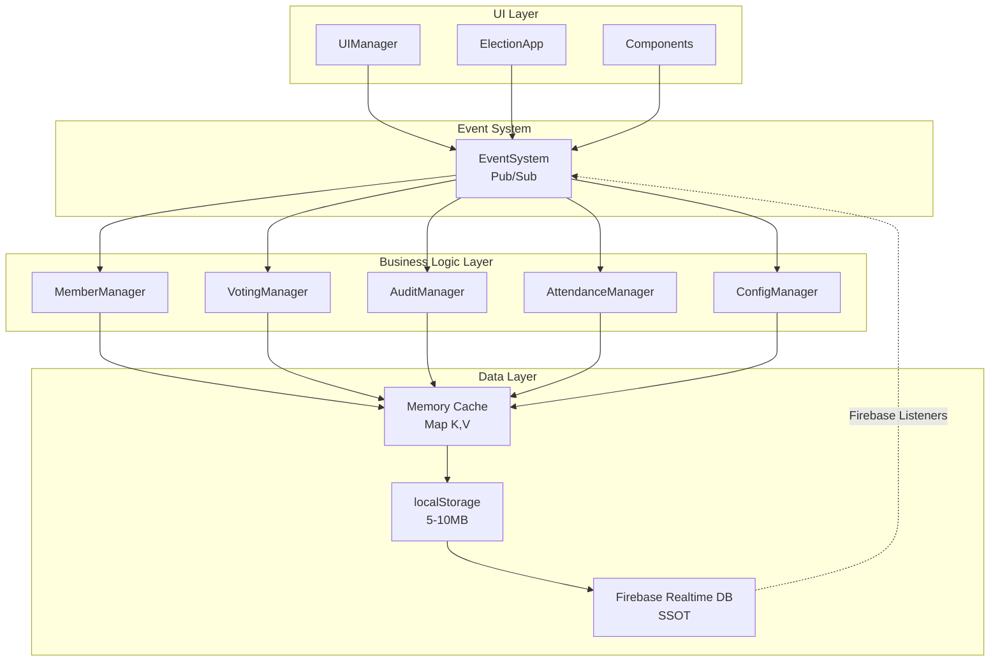
```mermaid
graph TB
    subgraph "UI Layer"
        A[UIManager]
        B[ElectionApp]
        C[Components]
    end

    subgraph "Business Logic Layer"
        D[MemberManager]
        E[VotingManager]
        F[AuditManager]
        G[AttendanceManager]
        H[ConfigManager]
    end

    subgraph "Data Layer"
        I[Memory Cache<br/>Map K,V]
        J[localStorage<br/>5-10MB]
        K[Firebase Realtime DB<br/>SSOT]
    end

    subgraph "Event System"
        L[EventSystem<br/>Pub/Sub]
    end

    A --> L
    B --> L
    C --> L

    L --> D
    L --> E
    L --> F
    L --> G
    L --> H

    D --> I
    E --> I
    F --> I
    G --> I
    H --> I

    I --> J
    J --> K

    K -.Firebase Listeners.-> L
```

### 1.2 Estrutura de Dados no Firebase

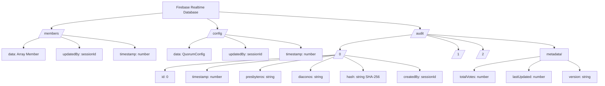
```mermaid
graph TB
    A[Firebase Realtime Database] --> B[/members/]
    A --> C[/config/]
    A --> D[/audit/]

    B --> B1[data: Array Member]
    B --> B2[updatedBy: sessionId]
    B --> B3[timestamp: number]

    C --> C1[data: QuorumConfig]
    C --> C2[updatedBy: sessionId]
    C --> C3[timestamp: number]

    D --> D1[/0/]
    D --> D2[/1/]
    D --> D3[/2/]
    D --> D4[metadata/]

    D1 --> E1[id: 0]
    D1 --> E2[timestamp: number]
    D1 --> E3[presbyteros: string]
    D1 --> E4[diaconos: string]
    D1 --> E5[hash: string SHA-256]
    D1 --> E6[createdBy: sessionId]

    D4 --> F1[totalVotes: number]
    D4 --> F2[lastUpdated: number]
    D4 --> F3[version: string]
```

---

## 2. Fluxo Completo de Votação

### 2.1 Ciclo de Votação Fullscreen (Multi-Telas)

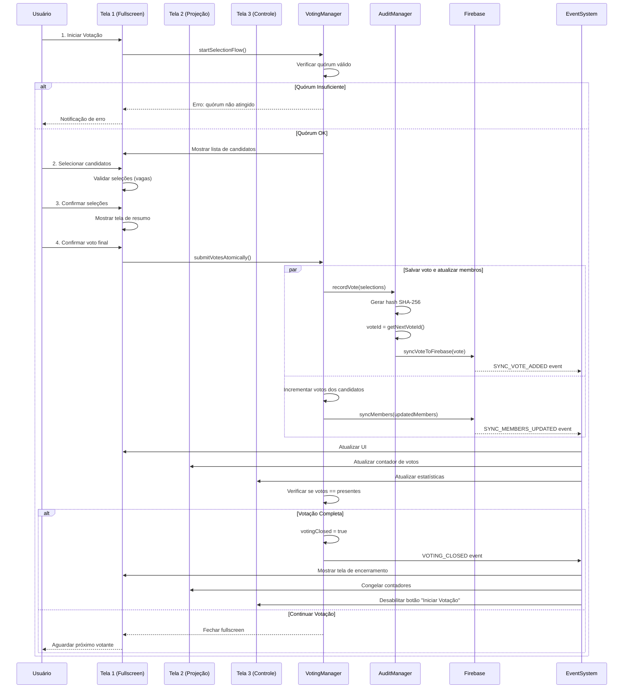
```mermaid
sequenceDiagram
    participant U as Usuário
    participant T1 as Tela 1 (Fullscreen)
    participant T2 as Tela 2 (Projeção)
    participant T3 as Tela 3 (Controle)
    participant VM as VotingManager
    participant AM as AuditManager
    participant FB as Firebase
    participant ES as EventSystem

    U->>T1: 1. Iniciar Votação
    T1->>VM: startSelectionFlow()
    VM->>VM: Verificar quórum válido

    alt Quórum Insuficiente
        VM-->>T1: Erro: quórum não atingido
        T1-->>U: Notificação de erro
    else Quórum OK
        VM->>T1: Mostrar lista de candidatos
        U->>T1: 2. Selecionar candidatos
        T1->>T1: Validar seleções (vagas)

        U->>T1: 3. Confirmar seleções
        T1->>T1: Mostrar tela de resumo

        U->>T1: 4. Confirmar voto final
        T1->>VM: submitVotesAtomically()

        par Salvar voto e atualizar membros
            VM->>AM: recordVote(selections)
            AM->>AM: Gerar hash SHA-256
            AM->>AM: voteId = getNextVoteId()
            AM->>FB: syncVoteToFirebase(vote)
            FB-->>ES: SYNC_VOTE_ADDED event
        and
            VM->>VM: Incrementar votos dos candidatos
            VM->>FB: syncMembers(updatedMembers)
            FB-->>ES: SYNC_MEMBERS_UPDATED event
        end

        ES->>T1: Atualizar UI
        ES->>T2: Atualizar contador de votos
        ES->>T3: Atualizar estatísticas

        VM->>VM: Verificar se votos == presentes

        alt Votação Completa
            VM->>VM: votingClosed = true
            VM->>ES: VOTING_CLOSED event
            ES->>T1: Mostrar tela de encerramento
            ES->>T2: Congelar contadores
            ES->>T3: Desabilitar botão "Iniciar Votação"
        else Continuar Votação
            VM-->>T1: Fechar fullscreen
            T1-->>U: Aguardar próximo votante
        end
    end
```

### 2.2 Fluxo de Decisão de Votação

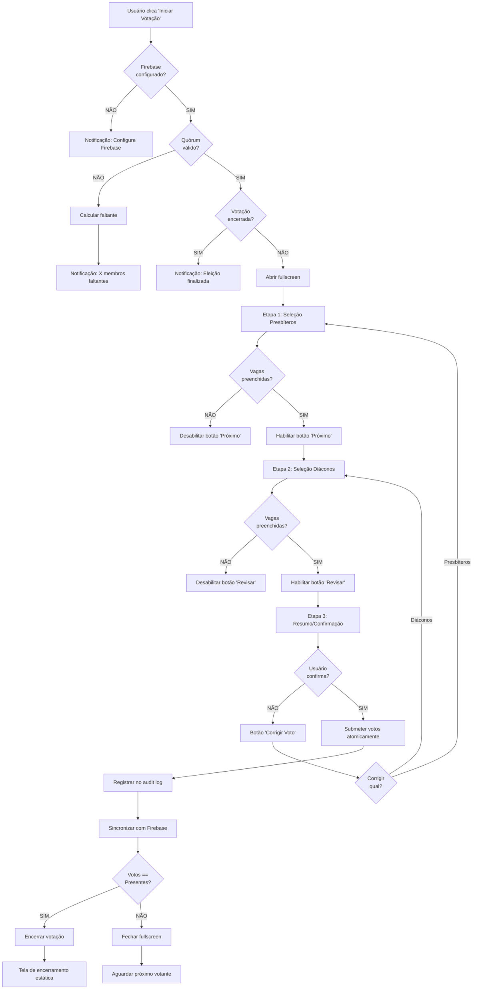
```mermaid
graph TD
    A[Usuário clica 'Iniciar Votação'] --> B{Firebase<br/>configurado?}
    B -->|NÃO| C[Notificação: Configure Firebase]
    B -->|SIM| D{Quórum<br/>válido?}

    D -->|NÃO| E[Calcular faltante]
    E --> F[Notificação: X membros faltantes]

    D -->|SIM| G{Votação<br/>encerrada?}
    G -->|SIM| H[Notificação: Eleição finalizada]

    G -->|NÃO| I[Abrir fullscreen]
    I --> J[Etapa 1: Seleção Presbíteros]

    J --> K{Vagas<br/>preenchidas?}
    K -->|NÃO| L[Desabilitar botão 'Próximo']
    K -->|SIM| M[Habilitar botão 'Próximo']

    M --> N[Etapa 2: Seleção Diáconos]

    N --> O{Vagas<br/>preenchidas?}
    O -->|NÃO| P[Desabilitar botão 'Revisar']
    O -->|SIM| Q[Habilitar botão 'Revisar']

    Q --> R[Etapa 3: Resumo/Confirmação]
    R --> S{Usuário<br/>confirma?}

    S -->|NÃO| T[Botão 'Corrigir Voto']
    T --> U{Corrigir<br/>qual?}
    U -->|Presbíteros| J
    U -->|Diáconos| N

    S -->|SIM| V[Submeter votos atomicamente]
    V --> W[Registrar no audit log]
    W --> X[Sincronizar com Firebase]

    X --> Y{Votos ==<br/>Presentes?}
    Y -->|SIM| Z[Encerrar votação]
    Y -->|NÃO| AA[Fechar fullscreen]

    Z --> AB[Tela de encerramento estática]
    AA --> AC[Aguardar próximo votante]
```

---

## 3. Sincronização Multi-Dispositivo

### 3.1 Propagação de Eventos Firebase

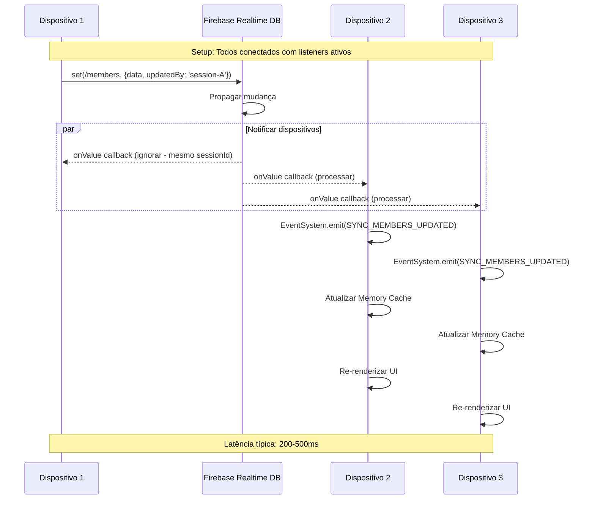
```mermaid
sequenceDiagram
    participant D1 as Dispositivo 1
    participant FB as Firebase Realtime DB
    participant D2 as Dispositivo 2
    participant D3 as Dispositivo 3

    Note over D1,D3: Setup: Todos conectados com listeners ativos

    D1->>FB: set(/members, {data, updatedBy: 'session-A'})
    FB->>FB: Propagar mudança

    par Notificar dispositivos
        FB-->>D1: onValue callback (ignorar - mesmo sessionId)
        FB-->>D2: onValue callback (processar)
        FB-->>D3: onValue callback (processar)
    end

    D2->>D2: EventSystem.emit(SYNC_MEMBERS_UPDATED)
    D3->>D3: EventSystem.emit(SYNC_MEMBERS_UPDATED)

    D2->>D2: Atualizar Memory Cache
    D3->>D3: Atualizar Memory Cache

    D2->>D2: Re-renderizar UI
    D3->>D3: Re-renderizar UI

    Note over D1,D3: Latência típica: 200-500ms
```

### 3.2 Prevenção de Loop Infinito

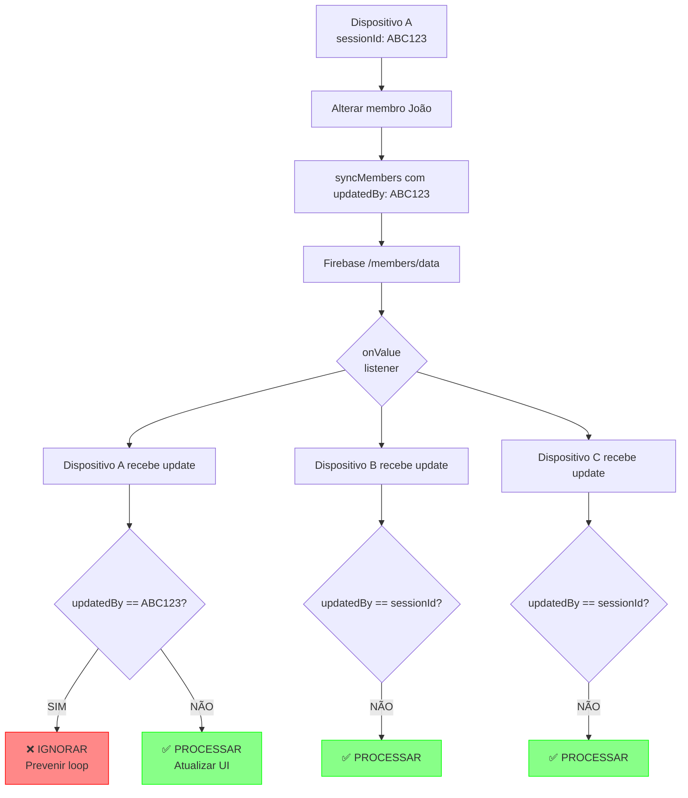
```mermaid
graph TB
    A[Dispositivo A<br/>sessionId: ABC123] --> B[Alterar membro João]
    B --> C[syncMembers com updatedBy: ABC123]
    C --> D[Firebase /members/data]

    D --> E{onValue<br/>listener}
    E --> F[Dispositivo A recebe update]
    E --> G[Dispositivo B recebe update]
    E --> H[Dispositivo C recebe update]

    F --> I{updatedBy == ABC123?}
    I -->|SIM| J[❌ IGNORAR<br/>Prevenir loop]
    I -->|NÃO| K[✅ PROCESSAR<br/>Atualizar UI]

    G --> L{updatedBy == sessionId?}
    L -->|NÃO| M[✅ PROCESSAR]

    H --> N{updatedBy == sessionId?}
    N -->|NÃO| O[✅ PROCESSAR]

    style J fill:#f88,stroke:#f00
    style K fill:#8f8,stroke:#0f0
    style M fill:#8f8,stroke:#0f0
    style O fill:#8f8,stroke:#0f0
```

### 3.3 Cenário de Race Condition (PROBLEMA)

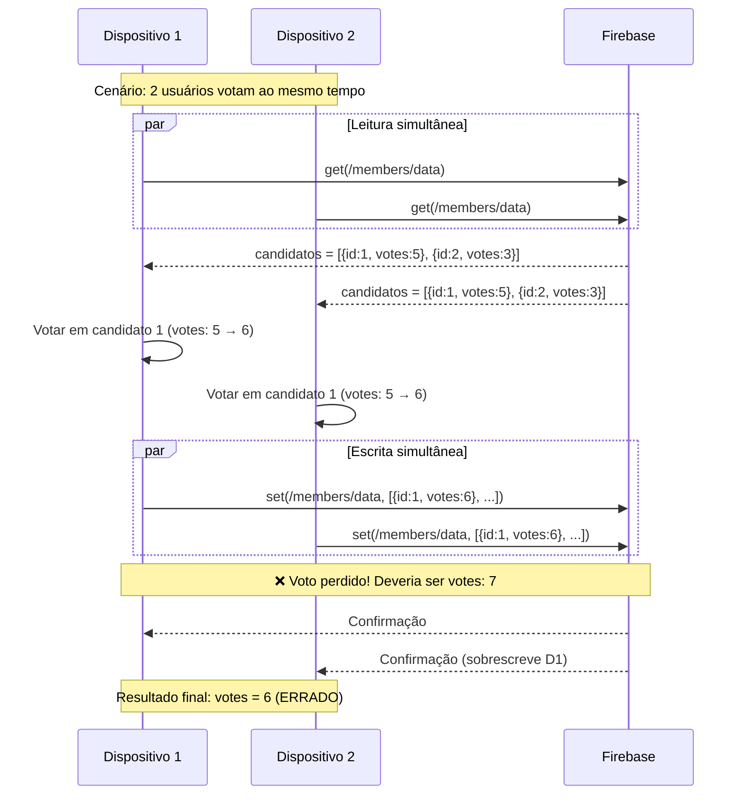
```mermaid
sequenceDiagram
    participant D1 as Dispositivo 1
    participant D2 as Dispositivo 2
    participant FB as Firebase

    Note over D1,D2: Cenário: 2 usuários votam ao mesmo tempo

    par Leitura simultânea
        D1->>FB: get(/members/data)
        D2->>FB: get(/members/data)
    end

    FB-->>D1: candidatos = [{id:1, votes:5}, {id:2, votes:3}]
    FB-->>D2: candidatos = [{id:1, votes:5}, {id:2, votes:3}]

    D1->>D1: Votar em candidato 1 (votes: 5 → 6)
    D2->>D2: Votar em candidato 1 (votes: 5 → 6)

    par Escrita simultânea
        D1->>FB: set(/members/data, [{id:1, votes:6}, ...])
        D2->>FB: set(/members/data, [{id:1, votes:6}, ...])
    end

    Note over D1,FB: ❌ Voto perdido! Deveria ser votes: 7

    FB-->>D1: Confirmação
    FB-->>D2: Confirmação (sobrescreve D1)

    Note over D1,D2: Resultado final: votes = 6 (ERRADO)
```

### 3.4 Solução com Transação Atômica (SOLUÇÃO)

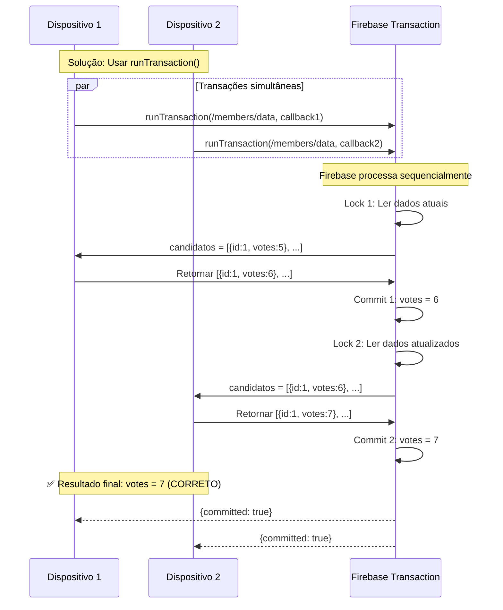
```mermaid
sequenceDiagram
    participant D1 as Dispositivo 1
    participant D2 as Dispositivo 2
    participant FB as Firebase Transaction

    Note over D1,D2: Solução: Usar runTransaction()

    par Transações simultâneas
        D1->>FB: runTransaction(/members/data, callback1)
        D2->>FB: runTransaction(/members/data, callback2)
    end

    Note over FB: Firebase processa sequencialmente

    FB->>FB: Lock 1: Ler dados atuais
    FB->>D1: candidatos = [{id:1, votes:5}, ...]
    D1->>FB: Retornar [{id:1, votes:6}, ...]
    FB->>FB: Commit 1: votes = 6

    FB->>FB: Lock 2: Ler dados atualizados
    FB->>D2: candidatos = [{id:1, votes:6}, ...]
    D2->>FB: Retornar [{id:1, votes:7}, ...]
    FB->>FB: Commit 2: votes = 7

    Note over D1,D2: ✅ Resultado final: votes = 7 (CORRETO)

    FB-->>D1: {committed: true}
    FB-->>D2: {committed: true}
```

---

## 4. Gestão de Membros

### 4.1 Ciclo de Vida de um Membro

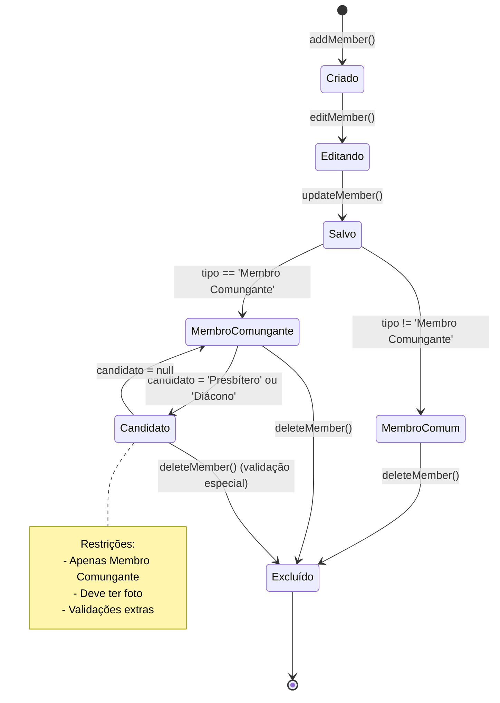
```mermaid
stateDiagram-v2
    [*] --> Criado: addMember()

    Criado --> Editando: editMember()
    Editando --> Salvo: updateMember()

    Salvo --> MembroComum: tipo != 'Membro Comungante'
    Salvo --> MembroComungante: tipo == 'Membro Comungante'

    MembroComungante --> Candidato: candidato = 'Presbítero' ou 'Diácono'
    Candidato --> MembroComungante: candidato = null

    MembroComum --> Excluído: deleteMember()
    MembroComungante --> Excluído: deleteMember()
    Candidato --> Excluído: deleteMember() (validação especial)

    Excluído --> [*]

    note right of Candidato
        Restrições:
        - Apenas Membro Comungante
        - Deve ter foto
        - Validações extras
    end note
```

### 4.2 Fluxo de Importação CSV

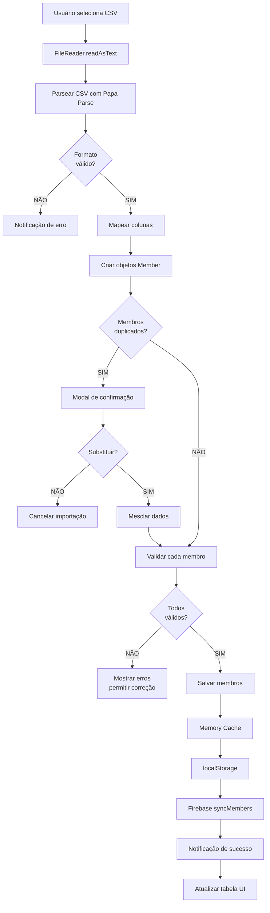
```mermaid
graph TB
    A[Usuário seleciona CSV] --> B[FileReader.readAsText]
    B --> C[Parsear CSV com Papa Parse]

    C --> D{Formato<br/>válido?}
    D -->|NÃO| E[Notificação de erro]

    D -->|SIM| F[Mapear colunas]
    F --> G[Criar objetos Member]

    G --> H{Membros<br/>duplicados?}
    H -->|SIM| I[Modal de confirmação]
    I --> J{Substituir?}
    J -->|NÃO| K[Cancelar importação]
    J -->|SIM| L[Mesclar dados]

    H -->|NÃO| M[Validar cada membro]
    L --> M

    M --> N{Todos<br/>válidos?}
    N -->|NÃO| O[Mostrar erros<br/>permitir correção]

    N -->|SIM| P[Salvar membros]
    P --> Q[Memory Cache]
    Q --> R[localStorage]
    R --> S[Firebase syncMembers]

    S --> T[Notificação de sucesso]
    T --> U[Atualizar tabela UI]
```

---

## 5. Sistema de Presença

### 5.1 Fluxo de Marcar Presença

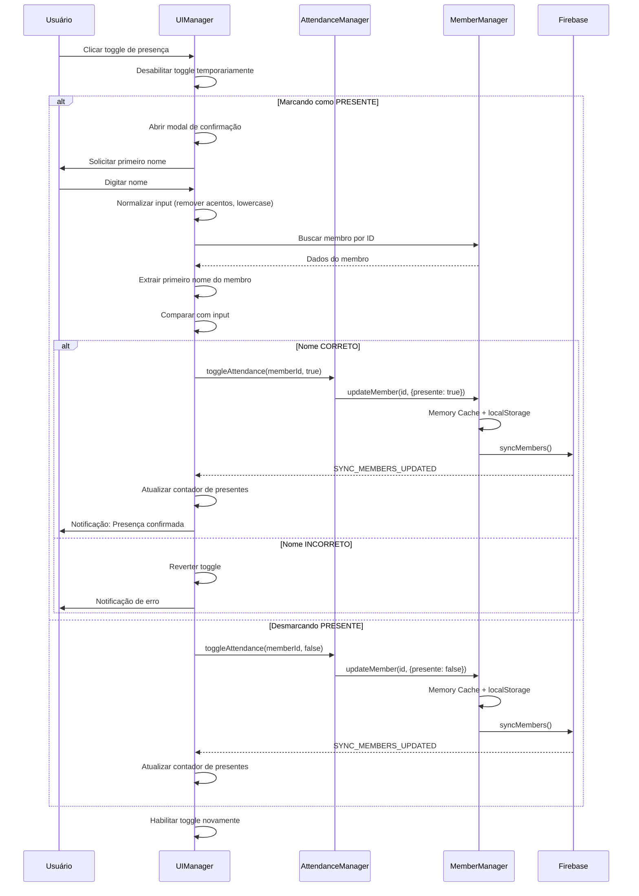
```mermaid
sequenceDiagram
    participant U as Usuário
    participant UI as UIManager
    participant AM as AttendanceManager
    participant MM as MemberManager
    participant FB as Firebase

    U->>UI: Clicar toggle de presença
    UI->>UI: Desabilitar toggle temporariamente

    alt Marcando como PRESENTE
        UI->>UI: Abrir modal de confirmação
        UI->>U: Solicitar primeiro nome
        U->>UI: Digitar nome

        UI->>UI: Normalizar input (remover acentos, lowercase)
        UI->>MM: Buscar membro por ID
        MM-->>UI: Dados do membro

        UI->>UI: Extrair primeiro nome do membro
        UI->>UI: Comparar com input

        alt Nome CORRETO
            UI->>AM: toggleAttendance(memberId, true)
            AM->>MM: updateMember(id, {presente: true})
            MM->>MM: Memory Cache + localStorage
            MM->>FB: syncMembers()
            FB-->>UI: SYNC_MEMBERS_UPDATED
            UI->>UI: Atualizar contador de presentes
            UI->>U: Notificação: Presença confirmada
        else Nome INCORRETO
            UI->>UI: Reverter toggle
            UI->>U: Notificação de erro
        end
    else Desmarcando PRESENTE
        UI->>AM: toggleAttendance(memberId, false)
        AM->>MM: updateMember(id, {presente: false})
        MM->>MM: Memory Cache + localStorage
        MM->>FB: syncMembers()
        FB-->>UI: SYNC_MEMBERS_UPDATED
        UI->>UI: Atualizar contador de presentes
    end

    UI->>UI: Habilitar toggle novamente
```

### 5.2 Sincronização de Presença Multi-Tablet

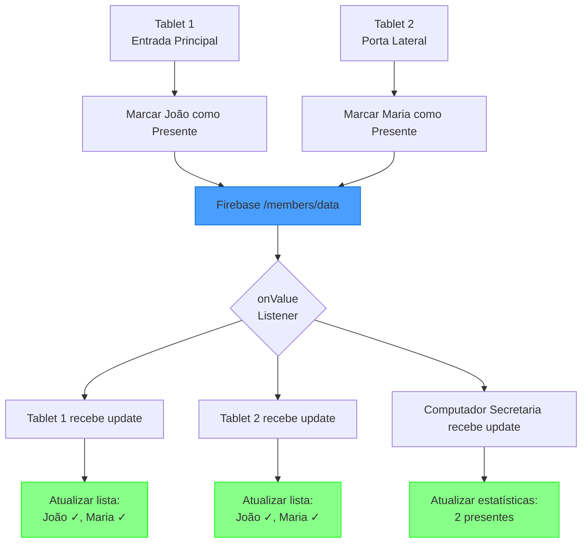
```mermaid
graph TB
    A[Tablet 1<br/>Entrada Principal] --> B[Marcar João como Presente]
    C[Tablet 2<br/>Porta Lateral] --> D[Marcar Maria como Presente]

    B --> E[Firebase /members/data]
    D --> E

    E --> F{onValue<br/>Listener}

    F --> G[Tablet 1 recebe update]
    F --> H[Tablet 2 recebe update]
    F --> I[Computador Secretaria recebe update]

    G --> J[Atualizar lista:<br/>João ✓, Maria ✓]
    H --> K[Atualizar lista:<br/>João ✓, Maria ✓]
    I --> L[Atualizar estatísticas:<br/>2 presentes]

    style E fill:#4a9eff,stroke:#0066cc
    style J fill:#8f8,stroke:#0f0
    style K fill:#8f8,stroke:#0f0
    style L fill:#8f8,stroke:#0f0
```

---

## 6. Auditoria de Votos

### 6.1 Registro de Voto Individual

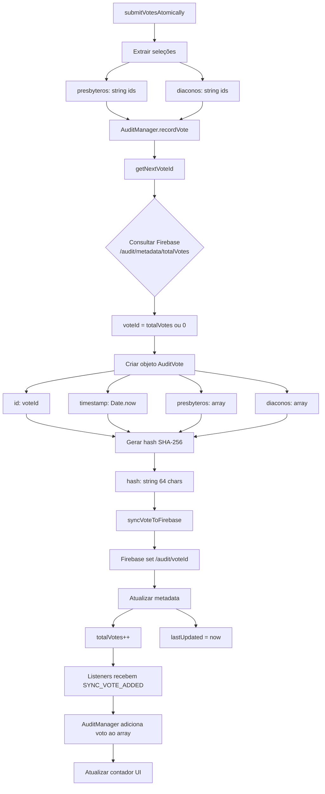
```mermaid
graph TB
    A[submitVotesAtomically] --> B[Extrair seleções]
    B --> C[presbyteros: string ids]
    B --> D[diaconos: string ids]

    C --> E[AuditManager.recordVote]
    D --> E

    E --> F[getNextVoteId]
    F --> G{Consultar Firebase<br/>/audit/metadata/totalVotes}
    G --> H[voteId = totalVotes ou 0]

    H --> I[Criar objeto AuditVote]
    I --> J[id: voteId]
    I --> K[timestamp: Date.now]
    I --> L[presbyteros: array]
    I --> M[diaconos: array]

    J --> N[Gerar hash SHA-256]
    K --> N
    L --> N
    M --> N

    N --> O[hash: string 64 chars]

    O --> P[syncVoteToFirebase]
    P --> Q[Firebase set /audit/voteId]

    Q --> R[Atualizar metadata]
    R --> S[totalVotes++]
    R --> T[lastUpdated = now]

    S --> U[Listeners recebem SYNC_VOTE_ADDED]
    U --> V[AuditManager adiciona voto ao array]
    V --> W[Atualizar contador UI]
```

### 6.2 Validação de Integridade

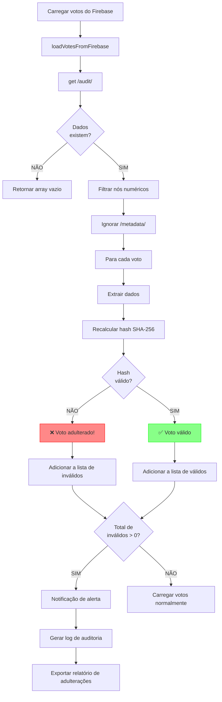
```mermaid
graph TB
    A[Carregar votos do Firebase] --> B[loadVotesFromFirebase]
    B --> C[get /audit/]

    C --> D{Dados<br/>existem?}
    D -->|NÃO| E[Retornar array vazio]

    D -->|SIM| F[Filtrar nós numéricos]
    F --> G[Ignorar /metadata/]

    G --> H[Para cada voto]
    H --> I[Extrair dados]
    I --> J[Recalcular hash SHA-256]

    J --> K{Hash<br/>válido?}
    K -->|NÃO| L[❌ Voto adulterado!]
    K -->|SIM| M[✅ Voto válido]

    L --> N[Adicionar a lista de inválidos]
    M --> O[Adicionar a lista de válidos]

    N --> P{Total de<br/>inválidos > 0?}
    O --> P

    P -->|SIM| Q[Notificação de alerta]
    P -->|NÃO| R[Carregar votos normalmente]

    Q --> S[Gerar log de auditoria]
    S --> T[Exportar relatório de adulterações]

    style L fill:#f88,stroke:#f00
    style M fill:#8f8,stroke:#0f0
```

---

## 7. Tratamento de Erros

### 7.1 Hierarquia de Erros

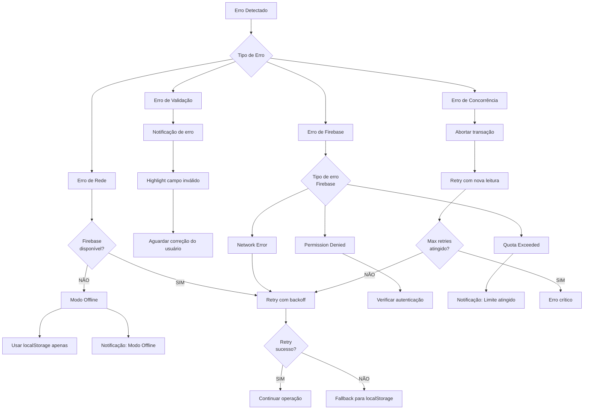
```mermaid
graph TB
    A[Erro Detectado] --> B{Tipo de Erro}

    B --> C[Erro de Rede]
    B --> D[Erro de Validação]
    B --> E[Erro de Firebase]
    B --> F[Erro de Concorrência]

    C --> G{Firebase<br/>disponível?}
    G -->|NÃO| H[Modo Offline]
    G -->|SIM| I[Retry com backoff]

    H --> J[Usar localStorage apenas]
    H --> K[Notificação: Modo Offline]

    I --> L{Retry<br/>sucesso?}
    L -->|SIM| M[Continuar operação]
    L -->|NÃO| N[Fallback para localStorage]

    D --> O[Notificação de erro]
    O --> P[Highlight campo inválido]
    P --> Q[Aguardar correção do usuário]

    E --> R{Tipo de erro<br/>Firebase}
    R --> S[Permission Denied]
    R --> T[Quota Exceeded]
    R --> U[Network Error]

    S --> V[Verificar autenticação]
    T --> W[Notificação: Limite atingido]
    U --> I

    F --> X[Abortar transação]
    X --> Y[Retry com nova leitura]
    Y --> Z{Max retries<br/>atingido?}
    Z -->|SIM| AA[Erro crítico]
    Z -->|NÃO| I
```

---

## 8. Fluxo de Autenticação

### 8.1 Login e Autorização

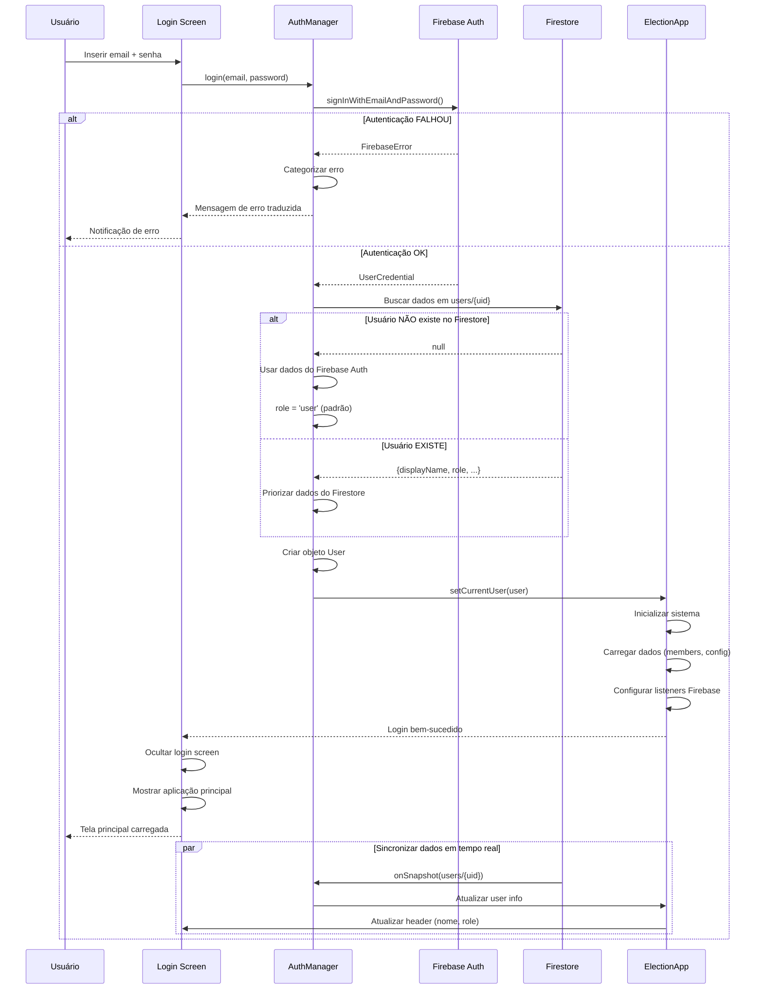
```mermaid
sequenceDiagram
    participant U as Usuário
    participant UI as Login Screen
    participant AM as AuthManager
    participant FB as Firebase Auth
    participant FS as Firestore
    participant APP as ElectionApp

    U->>UI: Inserir email + senha
    UI->>AM: login(email, password)

    AM->>FB: signInWithEmailAndPassword()

    alt Autenticação FALHOU
        FB-->>AM: FirebaseError
        AM->>AM: Categorizar erro
        AM-->>UI: Mensagem de erro traduzida
        UI-->>U: Notificação de erro
    else Autenticação OK
        FB-->>AM: UserCredential
        AM->>FS: Buscar dados em users/{uid}

        alt Usuário NÃO existe no Firestore
            FS-->>AM: null
            AM->>AM: Usar dados do Firebase Auth
            AM->>AM: role = 'user' (padrão)
        else Usuário EXISTE
            FS-->>AM: {displayName, role, ...}
            AM->>AM: Priorizar dados do Firestore
        end

        AM->>AM: Criar objeto User
        AM->>APP: setCurrentUser(user)

        APP->>APP: Inicializar sistema
        APP->>APP: Carregar dados (members, config)
        APP->>APP: Configurar listeners Firebase

        APP-->>UI: Login bem-sucedido
        UI->>UI: Ocultar login screen
        UI->>UI: Mostrar aplicação principal
        UI-->>U: Tela principal carregada

        par Sincronizar dados em tempo real
            FS->>AM: onSnapshot(users/{uid})
            AM->>APP: Atualizar user info
            APP->>UI: Atualizar header (nome, role)
        end
    end
```

### 8.2 Proteção de Rotas por Role

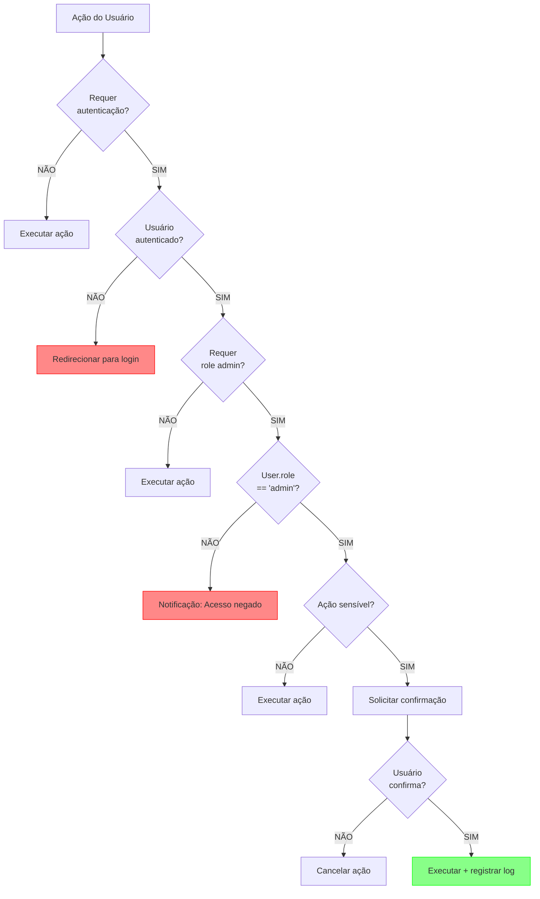
```mermaid
graph TB
    A[Ação do Usuário] --> B{Requer<br/>autenticação?}
    B -->|NÃO| C[Executar ação]

    B -->|SIM| D{Usuário<br/>autenticado?}
    D -->|NÃO| E[Redirecionar para login]

    D -->|SIM| F{Requer<br/>role admin?}
    F -->|NÃO| G[Executar ação]

    F -->|SIM| H{User.role<br/>== 'admin'?}
    H -->|NÃO| I[Notificação: Acesso negado]

    H -->|SIM| J{Ação sensível?}
    J -->|NÃO| K[Executar ação]

    J -->|SIM| L[Solicitar confirmação]
    L --> M{Usuário<br/>confirma?}
    M -->|NÃO| N[Cancelar ação]
    M -->|SIM| O[Executar + registrar log]

    style E fill:#f88,stroke:#f00
    style I fill:#f88,stroke:#f00
    style O fill:#8f8,stroke:#0f0
```

---

## 9. Cenários Complexos Multi-Tela

### 9.1 Eleição Completa com 4 Dispositivos

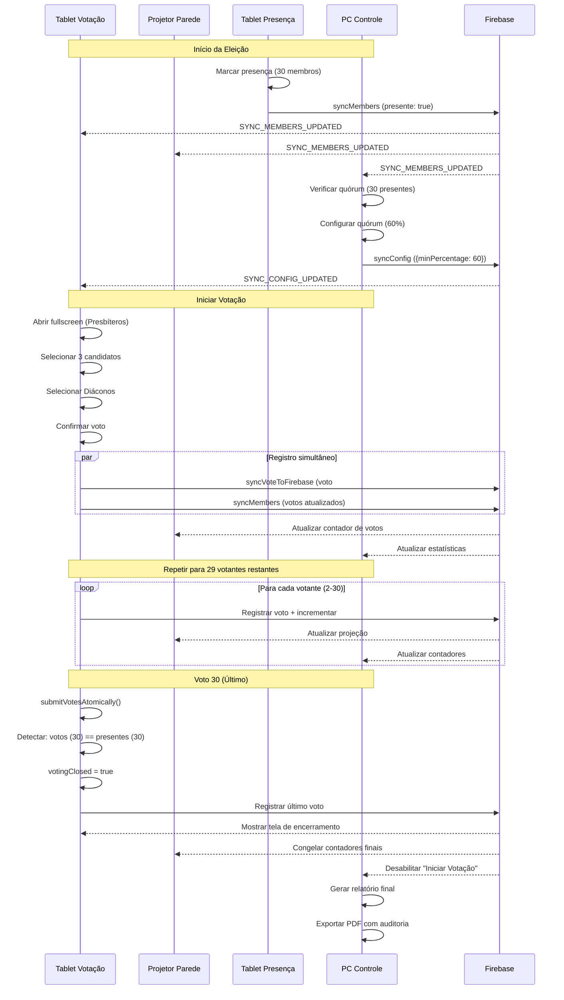
```mermaid
sequenceDiagram
    participant T1 as Tablet Votação
    participant T2 as Projetor Parede
    participant T3 as Tablet Presença
    participant T4 as PC Controle
    participant FB as Firebase

    Note over T1,T4: Início da Eleição

    T3->>T3: Marcar presença (30 membros)
    T3->>FB: syncMembers (presente: true)
    FB-->>T1: SYNC_MEMBERS_UPDATED
    FB-->>T2: SYNC_MEMBERS_UPDATED
    FB-->>T4: SYNC_MEMBERS_UPDATED

    T4->>T4: Verificar quórum (30 presentes)
    T4->>T4: Configurar quórum (60%)
    T4->>FB: syncConfig ({minPercentage: 60})
    FB-->>T1: SYNC_CONFIG_UPDATED

    Note over T1,T4: Iniciar Votação

    T1->>T1: Abrir fullscreen (Presbíteros)
    T1->>T1: Selecionar 3 candidatos
    T1->>T1: Selecionar Diáconos
    T1->>T1: Confirmar voto

    par Registro simultâneo
        T1->>FB: syncVoteToFirebase (voto #1)
        T1->>FB: syncMembers (votos atualizados)
    end

    FB-->>T2: Atualizar contador de votos
    FB-->>T4: Atualizar estatísticas

    Note over T1,T4: Repetir para 29 votantes restantes

    loop Para cada votante (2-30)
        T1->>FB: Registrar voto + incrementar
        FB-->>T2: Atualizar projeção
        FB-->>T4: Atualizar contadores
    end

    Note over T1,T4: Voto 30 (Último)

    T1->>T1: submitVotesAtomically()
    T1->>T1: Detectar: votos (30) == presentes (30)
    T1->>T1: votingClosed = true

    T1->>FB: Registrar último voto
    FB-->>T1: Mostrar tela de encerramento
    FB-->>T2: Congelar contadores finais
    FB-->>T4: Desabilitar "Iniciar Votação"

    T4->>T4: Gerar relatório final
    T4->>T4: Exportar PDF com auditoria
```

---

## 10. Resumo de Pontos Críticos

### 10.1 Pontos de Sincronização

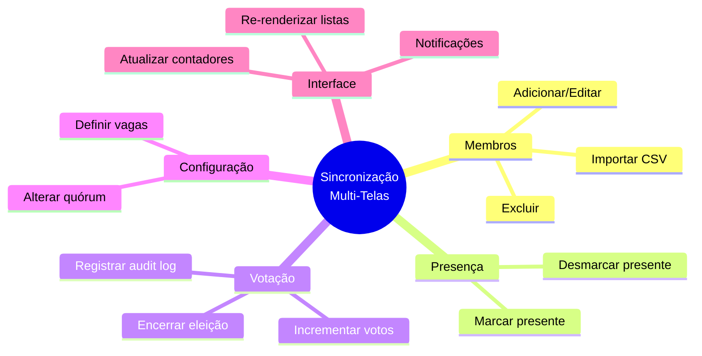
```mermaid
mindmap
  root((Sincronização<br/>Multi-Telas))
    Membros
      Adicionar/Editar
      Excluir
      Importar CSV
    Presença
      Marcar presente
      Desmarcar presente
    Votação
      Incrementar votos
      Registrar audit log
      Encerrar eleição
    Configuração
      Alterar quórum
      Definir vagas
    Interface
      Atualizar contadores
      Re-renderizar listas
      Notificações
```

### 10.2 Pontos de Falha Potenciais

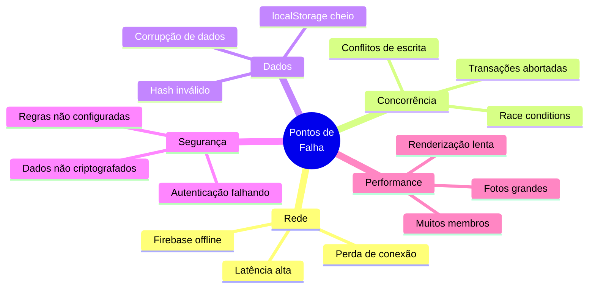
```mermaid
mindmap
  root((Pontos de<br/>Falha))
    Rede
      Perda de conexão
      Latência alta
      Firebase offline
    Concorrência
      Race conditions
      Conflitos de escrita
      Transações abortadas
    Dados
      localStorage cheio
      Corrupção de dados
      Hash inválido
    Segurança
      Regras não configuradas
      Dados não criptografados
      Autenticação falhando
    Performance
      Muitos membros
      Fotos grandes
      Renderização lenta
```

---

## 📚 Conclusão

Este documento apresenta **todos os fluxos críticos** do sistema de eleição multi-telas. Use-o como referência para:

1. **Desenvolvimento:** Entender como cada componente se conecta
2. **Debugging:** Identificar onde um erro pode ocorrer
3. **Testes:** Validar todos os cenários possíveis
4. **Documentação:** Explicar o sistema para novos desenvolvedores

**Próximos Passos:**

- Implementar correções de segurança (ver ANALISE-SEGURANCA-VERSAO-FINAL.md)
- Testar todos os cenários mapeados
- Validar sincronização em 3+ dispositivos
- Preparar para produção

---

**Última Atualização:** 18/11/2025  
**Versão:** 1.0  
**Compatível com:** Sistema v2.0.0
