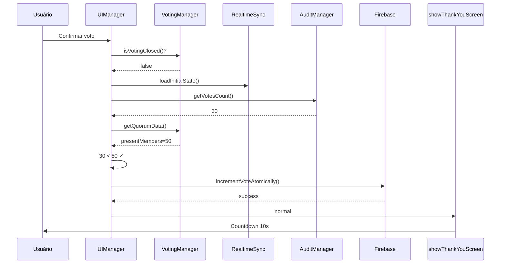
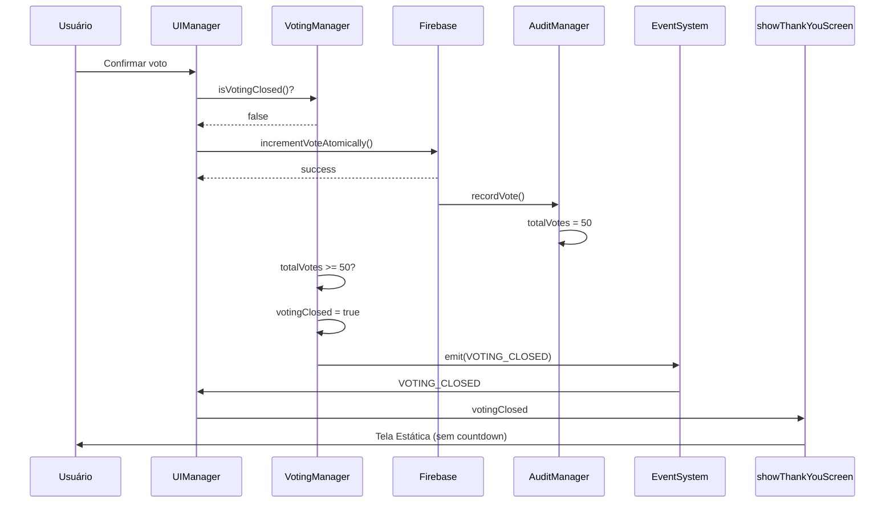
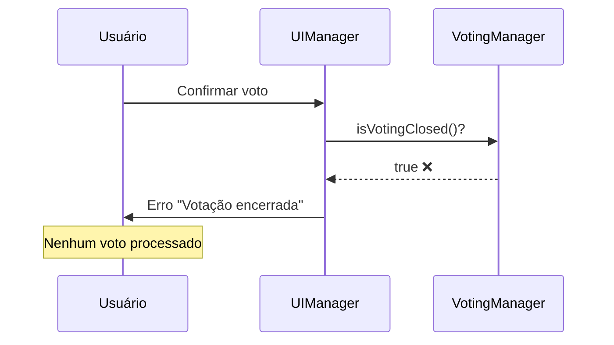

# Implementação: Limite de Votos = Presentes

**Data:** 05/novembro/2025  
**Versão:** 2.0.0  
**Status:** ✅ Completo

## 📋 Resumo Executivo

Implementado sistema de verificação e controle para garantir que o número de votos registrados não exceda o número de membros presentes. Quando o limite é atingido, a votação é automaticamente encerrada e uma tela estática de encerramento é exibida no fullscreen, substituindo o countdown de reinício.

## 🎯 Objetivos

- ✅ Impedir que votos sejam contabilizados além do número de presentes
- ✅ Encerrar automaticamente a votação quando limite atingido
- ✅ Substituir countdown por tela de encerramento definitiva
- ✅ Bloquear todas as entradas de voto após encerramento
- ✅ Impedir abertura do fullscreen quando votação já encerrada

## 🔧 Alterações Técnicas

### 1. Novo Evento: `VOTING_CLOSED`

**Arquivo:** `src/types/index.ts`

```typescript
export enum EventTypes {
  // ... outros eventos
  VOTING_CLOSED = "voting:closed", // Votação encerrada (votos = presentes)
}
```

**Propósito:** Notificar toda a aplicação quando votação for encerrada.

---

### 2. VotingManager: Flag e Validação

**Arquivo:** `src/modules/voting.ts`

#### Propriedade Adicionada

```typescript
private votingClosed = false; // Flag para indicar se votação foi encerrada
```

#### Método: `incrementVoteProjection()` (MODIFICADO)

**Antes:**

- Validava apenas existência do candidato
- Verificava se voto individual do candidato excedia presentes

**Depois:**

```typescript
async incrementVoteProjection(candidateId: string): Promise<AsyncResult<VotingData>> {
  // 0. Verificar se votação foi encerrada
  if (this.votingClosed) {
    return { success: false, error: "Votação encerrada" };
  }

  // 1. Validar candidato existe
  const candidate = await this.memberManager.getMember(candidateId);
  if (!candidate || !candidate.candidato) {
    return { success: false, error: "Candidato não encontrado" };
  }

  // 2. Verificar se TOTAL DE VOTOS (auditoria) atingiu limite de presentes
  const auditManager = (await import("./audit")).AuditManager.getInstance();
  const totalVotes = auditManager.getVotesCount();
  const quorumData = await this.getQuorumData();
  const presentMembers = quorumData.presentMembers;

  if (totalVotes >= presentMembers) {
    this.votingClosed = true;
    this.eventSystem.emit(EventTypes.VOTING_CLOSED, { totalVotes, presentMembers });
    return { success: false, error: "Votação encerrada - limite de votos atingido" };
  }

  // 3. Incrementar voto normalmente
  // ...
}
```

**Mudanças-chave:**

- Verifica `totalVotes` (da auditoria) ao invés de votos individuais
- Marca `votingClosed = true` quando limite atingido
- Emite evento `VOTING_CLOSED` para notificar sistema

#### Novos Métodos Públicos

```typescript
/**
 * Verificar se a votação foi encerrada (votos = presentes)
 */
isVotingClosed(): boolean {
  return this.votingClosed;
}

/**
 * Resetar flag de votação encerrada (usar ao iniciar nova votação)
 */
reopenVoting(): void {
  this.votingClosed = false;
  console.log("[VotingManager] 🔄 Votação reaberta");
}
```

#### Método: `resetVotes()` (ATUALIZADO)

```typescript
async resetVotes(): Promise<AsyncResult<void>> {
  // ... reset de votos dos candidatos ...

  // Resetar flag de votação encerrada
  this.votingClosed = false;

  return { success: true };
}
```

**Propósito:** Ao resetar votos (Zerésima), reabrir votação automaticamente.

---

### 3. UIManager: Validação e Tela de Encerramento

**Arquivo:** `src/ui/manager.ts`

#### Import Adicionado

```typescript
import { VotingManager } from "@/modules/voting";
```

#### Listener de Evento

```typescript
private setupEventListeners(): void {
  // ... outros listeners ...

  // Voting closed - mostrar tela de encerramento
  EventSystem.getInstance().on(EventTypes.VOTING_CLOSED, async (data: any) => {
    console.log("[UIManager] 🛑 Votação encerrada:", data);
    NotificationService.info(
      `Votação encerrada: ${data.totalVotes} votos registrados de ${data.presentMembers} presentes`
    );
    await this.showThankYouScreen();
  });
}
```

#### Método: `submitVotesAtomically()` (MODIFICADO)

**Validação Dupla Adicionada:**

```typescript
private async submitVotesAtomically(
  candidateIds: string[]
): Promise<{ success: boolean; error?: string }> {
  // ✅ VALIDAÇÃO 1: Verificar flag local
  const votingManager = VotingManager.getInstance();
  if (votingManager.isVotingClosed()) {
    return {
      success: false,
      error: "Votação encerrada - limite de votos atingido",
    };
  }

  // Sincronizar dados do Firebase
  await RealtimeSync.getInstance().loadInitialState();

  // ✅ VALIDAÇÃO 2: Verificar novamente após sincronização
  const auditManager = AuditManager.getInstance();
  const totalVotes = auditManager.getVotesCount();
  const quorumData = await votingManager.getQuorumData();
  const presentMembers = quorumData.presentMembers;

  if (totalVotes >= presentMembers) {
    return {
      success: false,
      error: "Votação encerrada - limite de votos atingido",
    };
  }

  // Processar votos normalmente
  // ...
}
```

**Por que validação dupla?**

1. **Validação 1 (flag):** Rápida, previne submissões óbvias após encerramento
2. **Validação 2 (contador):** Após sincronização Firebase, garante consistência em multi-dispositivo

#### Método: `showThankYouScreen()` (MODIFICADO)

**Antes:**

- Sempre mostrava countdown de 10 segundos
- Voltava automaticamente para prévia

**Depois:**

```typescript
private async showThankYouScreen(): Promise<void> {
  const fullscreenView = document.getElementById("fullscreen-view");
  const grid = document.getElementById("fullscreen-candidates-grid");
  const roleTitle = document.getElementById("fullscreen-role-title");
  if (!fullscreenView || !grid || !roleTitle) return;

  // ✅ VERIFICAR SE VOTAÇÃO FOI ENCERRADA
  const votingManager = VotingManager.getInstance();
  const auditManager = AuditManager.getInstance();
  const totalVotes = auditManager.getVotesCount();
  const quorumData = await votingManager.getQuorumData();
  const presentMembers = quorumData.presentMembers;
  const votingClosed = totalVotes >= presentMembers;

  if (votingClosed) {
    // ✅ TELA DE ENCERRAMENTO (ESTÁTICA - SEM COUNTDOWN)
    roleTitle.textContent = "Votação Encerrada";
    grid.innerHTML = `
      <div class="empty-state" style="padding: 6rem 1rem; text-align: center;">
        <span class="material-icons md-64" style="color: var(--success); font-size: 4rem;">check_circle</span>
        <h2 style="margin-top: 1.5rem; font-size: 2rem;">Votação Encerrada</h2>
        <p style="font-size: 1.25rem; margin-top: 1rem;">
          Todos os <strong>${totalVotes} votos</strong> dos membros presentes foram registrados.
        </p>
        <p style="font-size: 1rem; color: var(--text-tertiary); margin-top: 2rem;">
          Para sair desta tela, pressione <kbd>ESC</kbd> e digite a senha "sair".
        </p>
      </div>
    `;
    return; // ❌ NÃO iniciar countdown
  }

  // ✅ TELA NORMAL (COM COUNTDOWN DE 10s)
  roleTitle.textContent = "Obrigado";
  let countdown = 10;
  grid.innerHTML = `
    <div class="empty-state" style="padding: 6rem 1rem;">
      <span class="material-icons md-48">thumb_up</span>
      <h3>Obrigado por votar!</h3>
      <p id="countdown-text">Voltando para a prévia em <strong>${countdown}</strong> segundos...</p>
    </div>
  `;
  // ... lógica de countdown existente ...
}
```

**Design da Tela de Encerramento:**

- ✅ Ícone check_circle verde (4rem)
- ✅ Título "Votação Encerrada" (2rem)
- ✅ Mensagem com total de votos registrados
- ✅ Instrução de saída (ESC + senha "sair")
- ❌ Sem countdown
- ❌ Sem auto-reload

#### Método: `handleStartVoting()` (MODIFICADO)

**Novo comportamento:**

```typescript
private async handleStartVoting(): Promise<void> {
  try {
    // ✅ VALIDAÇÃO 1: Verificar flag de votação encerrada
    const votingManager = VotingManager.getInstance();
    if (votingManager.isVotingClosed()) {
      NotificationService.error(
        "Votação encerrada: todos os votos dos membros presentes já foram registrados."
      );
      return; // ❌ Bloqueia abertura do fullscreen
    }

    // ✅ VALIDAÇÃO 2: Verificar contador de votos
    const auditManager = AuditManager.getInstance();
    const totalVotes = auditManager.getVotesCount();
    const quorumData = await votingManager.getQuorumData();
    const presentMembers = quorumData.presentMembers;

    if (totalVotes >= presentMembers) {
      NotificationService.error(
        `Votação encerrada: ${totalVotes} votos já foram registrados de ${presentMembers} presentes.`
      );
      return; // ❌ Bloqueia abertura do fullscreen
    }

    // ✅ Validação de quórum
    const results = await electionApp.getElectionResults();
    if (!results.quorum?.isValid) {
      NotificationService.warning(
        "Quórum insuficiente para iniciar a votação."
      );
      return;
    }

    // ✅ Abrir fullscreen normalmente
    // ...
  } catch (error) {
    console.error("Erro ao iniciar votação:", error);
    NotificationService.error("Erro ao iniciar a votação");
  }
}
```

**Mudanças-chave:**

- **Validação 1 (flag):** Verificação rápida do estado local
- **Validação 2 (contador):** Verificação contra dados reais da auditoria
- **Mensagens de erro:** Informativas explicando por que votação está bloqueada
- **Return antecipado:** Impede completamente abertura do fullscreen

---

## 🔐 Fluxo de Segurança

### Cenário 1: Voto Normal (Presentes: 50, Votos: 30)



### Cenário 2: Último Voto (Presentes: 50, Votos: 49 → 50)



### Cenário 3: Tentativa Após Encerramento



---

## 🧪 Cenários de Teste

### Teste 1: Voto com Limite Não Atingido

**Setup:**

- 50 membros presentes
- 30 votos já registrados
- 1 novo voto sendo submetido

**Esperado:**

- ✅ Voto aceito
- ✅ Contador: 31/50
- ✅ Tela de agradecimento com countdown
- ✅ Retorna para prévia após 10s

---

### Teste 2: 50º Voto (Último Voto)

**Setup:**

- 50 membros presentes
- 49 votos já registrados
- 1 novo voto sendo submetido (o 50º)

**Esperado:**

- ✅ Voto aceito (49 → 50)
- ✅ `votingClosed = true`
- ✅ Evento `VOTING_CLOSED` emitido
- ✅ Tela de encerramento estática
- ✅ Mensagem: "Todos os 50 votos dos membros presentes foram registrados"
- ❌ Sem countdown
- ❌ Não volta para prévia

---

### Teste 3: Tentativa de 51º Voto

**Setup:**

- 50 membros presentes
- 50 votos já registrados
- `votingClosed = true`
- 1 novo voto sendo submetido

**Esperado:**

- ❌ Voto rejeitado
- ✅ Erro: "Votação encerrada - limite de votos atingido"
- ✅ Contador permanece: 50/50
- ✅ Tela de encerramento mantida

---

### Teste 4: Multi-Dispositivo (Race Condition)

**Setup:**

- 50 membros presentes
- 49 votos registrados
- Dispositivo A e B submetem voto simultaneamente

**Cenário A (Ideal):**

- Dispositivo A: Voto aceito (49 → 50)
- Dispositivo B: Sincroniza (loadInitialState), detecta 50/50, voto rejeitado

**Cenário B (Race):**

- Ambos passam validação inicial (49 < 50)
- Ambos tentam incrementar atomicamente
- Firebase Transactions garante apenas 1 sucesso
- Vencedor: voto aceito (49 → 50)
- Perdedor: transação falha, rollback automático

---

### Teste 5: Zerésima (Reset de Votos)

**Setup:**

- 50 membros presentes
- 50 votos registrados
- `votingClosed = true`
- Admin clica em "Zerésima"

**Esperado:**

- ✅ `VotingManager.resetVotes()` chamado
- ✅ Todos os votos zerados (audit + candidates)
- ✅ `votingClosed = false` (votação reaberta)
- ✅ PDF gerado com 0 votos
- ✅ Nova votação pode iniciar

---

### Teste 6: Tentativa de Abrir Fullscreen Após Encerramento (NOVO)

**Setup:**

- 50 membros presentes
- 50 votos já registrados
- `votingClosed = true`
- Usuário clica em "Iniciar Votação"

**Esperado:**

- ❌ Fullscreen NÃO abre
- ✅ Notificação de erro: "Votação encerrada: todos os votos dos membros presentes já foram registrados."
- ✅ Usuário permanece na aba "Votação"
- ✅ Sistema previne nova votação sem reset

---

## 📊 Pontos de Validação

### 0. `UIManager.handleStartVoting()` (NOVO)

```
ENTRADA: void (click no botão "Iniciar Votação")
VALIDAÇÃO:
  1. votingClosed == true? → Erro + Return
  2. totalVotes >= presentMembers? → Erro + Return
  3. quorum.isValid == false? → Warning + Return
  4. Todas ok? → Abrir fullscreen
SAÍDA: void (abre fullscreen ou exibe erro)
```

### 1. `VotingManager.incrementVoteProjection()`

```
ENTRADA: candidateId
VALIDAÇÃO:
  1. votingClosed == true? → Rejeitar
  2. totalVotes >= presentMembers? → Encerrar e Rejeitar
  3. Candidato existe? → Prosseguir
SAÍDA: AsyncResult<VotingData>
```

### 2. `UIManager.submitVotesAtomically()`

```
ENTRADA: candidateIds[]
VALIDAÇÃO:
  1. votingClosed == true? → Rejeitar
  2. Sincronizar Firebase
  3. totalVotes >= presentMembers? → Rejeitar
  4. Para cada candidato: transação atômica
SAÍDA: { success: boolean; error?: string }
```

### 3. `UIManager.showThankYouScreen()`

```
ENTRADA: void
VALIDAÇÃO:
  1. totalVotes >= presentMembers?
     → SIM: Tela estática de encerramento
     → NÃO: Countdown 10s + reload
SAÍDA: void (renderiza HTML)
```

---

## 🎨 Interface da Tela de Encerramento

### Elementos Visuais

| Elemento    | Tipo           | Valor                                                          | Estilo                                                           |
| ----------- | -------------- | -------------------------------------------------------------- | ---------------------------------------------------------------- |
| Ícone       | Material Icons | `check_circle`                                                 | `color: var(--success); font-size: 4rem`                         |
| Título      | `<h2>`         | "Votação Encerrada"                                            | `font-size: 2rem; margin-top: 1.5rem`                            |
| Mensagem    | `<p>`          | "Todos os **X votos** dos membros presentes foram registrados" | `font-size: 1.25rem; margin-top: 1rem`                           |
| Instrução   | `<p>`          | "Para sair desta tela, pressione ESC e digite a senha 'sair'"  | `font-size: 1rem; color: var(--text-tertiary); margin-top: 2rem` |
| Tag `<kbd>` | Inline         | "ESC"                                                          | Estilo padrão de teclado                                         |

### HTML Completo

```html
<div class="empty-state" style="padding: 6rem 1rem; text-align: center;">
  <span
    class="material-icons md-64"
    style="color: var(--success); font-size: 4rem;"
  >
    check_circle
  </span>
  <h2 style="margin-top: 1.5rem; font-size: 2rem; color: var(--text-primary);">
    Votação Encerrada
  </h2>
  <p
    style="font-size: 1.25rem; color: var(--text-secondary); margin-top: 1rem;"
  >
    Todos os <strong>50 votos</strong> dos membros presentes foram registrados.
  </p>
  <p style="font-size: 1rem; color: var(--text-tertiary); margin-top: 2rem;">
    Para sair desta tela, pressione <kbd>ESC</kbd> e digite a senha "sair".
  </p>
</div>
```

---

## 🔄 Ciclo de Vida da Votação

```
┌─────────────────┐
│ VOTAÇÃO ABERTA  │ votingClosed = false
│ (Inicial)       │
└────────┬────────┘
         │
         │ Votos registrados
         │ totalVotes < presentMembers
         ▼
┌─────────────────┐
│ VOTAÇÃO ATIVA   │ Incrementos permitidos
│                 │
└────────┬────────┘
         │
         │ totalVotes == presentMembers
         ▼
┌─────────────────┐
│ VOTAÇÃO         │ votingClosed = true
│ ENCERRADA       │ Evento VOTING_CLOSED
└────────┬────────┘
         │
         │ Tela estática (sem countdown)
         │ Incrementos bloqueados
         │
         │ Admin: Zerésima / Reset
         ▼
┌─────────────────┐
│ RESET           │ votingClosed = false
│ (Volta ao       │ totalVotes = 0
│  início)        │
└─────────────────┘
```

---

## 📈 Estatísticas de Alteração

| Métrica                 | Valor                                                                  |
| ----------------------- | ---------------------------------------------------------------------- |
| **Arquivos alterados**  | 3                                                                      |
| **Linhas adicionadas**  | ~150                                                                   |
| **Linhas removidas**    | ~30                                                                    |
| **Novos métodos**       | 2 (`isVotingClosed`, `reopenVoting`)                                   |
| **Eventos criados**     | 1 (`VOTING_CLOSED`)                                                    |
| **Pontos de validação** | 3 (incrementVoteProjection, submitVotesAtomically, showThankYouScreen) |
| **Build time**          | 8.30s                                                                  |
| **Bundle size**         | 182.51 kB (main)                                                       |

---

## ✅ Checklist de Implementação

- [x] Adicionar flag `votingClosed` em VotingManager
- [x] Criar evento `VOTING_CLOSED` em EventTypes
- [x] Modificar `incrementVoteProjection()` para verificar limite
- [x] Adicionar métodos `isVotingClosed()` e `reopenVoting()`
- [x] Atualizar `resetVotes()` para reabrir votação
- [x] Adicionar validação dupla em `submitVotesAtomically()`
- [x] Modificar `showThankYouScreen()` com lógica condicional
- [x] Criar tela estática de encerramento (HTML/CSS)
- [x] Adicionar listener de evento `VOTING_CLOSED` em UIManager
- [x] Importar VotingManager em UIManager
- [x] **Adicionar validação em `handleStartVoting()` para bloquear abertura do fullscreen**
- [x] Compilar projeto (build success)
- [x] Criar documentação completa

---

## 🚨 Considerações de Segurança

### Multi-Dispositivo

**Problema:** Dois usuários votam simultaneamente quando há 49/50 votos.

**Solução:**

1. Firebase Transactions garantem atomicidade
2. Validação dupla (pré e pós-sincronização)
3. Apenas 1 voto será aceito (49 → 50)
4. O outro receberá erro "Votação encerrada"

### Race Condition (Local)

**Problema:** Evento `VOTING_CLOSED` pode disparar antes de UI atualizar.

**Solução:**

- Listener chama `showThankYouScreen()` que **verifica novamente** o contador
- Garante que tela de encerramento só aparece quando `totalVotes >= presentMembers`

### Cache Inválido

**Problema:** Contador local desincronizado com Firebase.

**Solução:**

- `submitVotesAtomically()` sempre chama `loadInitialState()` antes de validar
- Garante dados frescos do Firebase

### Abertura Indevida do Fullscreen (NOVO)

**Problema:** Usuário tenta iniciar nova votação quando limite já atingido.

**Solução:**

- Validação dupla em `handleStartVoting()` (flag + contador)
- Mensagem de erro clara explicando situação
- Return antecipado previne abertura do fullscreen
- Sistema força uso do Reset (Zerésima) para nova votação

---

## 🔮 Próximos Passos

### Teste Manual Recomendado

1. **Cenário Base:**
   - Configurar 10 membros presentes
   - Votar em 9 membros
   - Observar contador: 9/10
   - Votar no 10º membro
   - **Validar:** Tela de encerramento aparece
   - **Validar:** Mensagem: "Todos os 10 votos..."
   - Tentar votar novamente → Erro esperado

2. **Cenário Bloqueio Fullscreen (NOVO):**
   - Configurar 5 membros presentes
   - Votar nos 5 membros (atingir limite)
   - Sair do fullscreen (ESC + senha "sair")
   - Tentar clicar em "Iniciar Votação" novamente
   - **Validar:** Fullscreen NÃO abre
   - **Validar:** Notificação de erro: "Votação encerrada: todos os votos..."
   - **Validar:** Usuário permanece na aba Votação

3. **Cenário Multi-Tab:**
   - Abrir 2 abas do navegador
   - Configurar 5 membros presentes
   - Votar em 4 membros
   - Simultaneamente (ambas as abas): clicar em "Confirmar Voto"
   - **Validar:** Apenas 1 aba aceita o voto
   - **Validar:** Outra aba mostra erro "Votação encerrada"

4. **Cenário Reset:**
   - Atingir limite de votos (encerrar votação)
   - Clicar em "Zerésima"
   - **Validar:** PDF gerado com 0 votos
   - **Validar:** Nova votação pode ser iniciada
   - **Validar:** Contador reseta para 0/X

### Melhorias Futuras

- [ ] Adicionar animação de confete ao atingir 100% dos votos
- [ ] Notificar administradores via email quando votação encerrar
- [ ] Gerar relatório automático ao atingir limite
- [ ] Mostrar progresso visual (barra de progresso) em tempo real
- [ ] Adicionar botão "Forçar Encerramento" para admin
- [ ] Log detalhado de quando/quem atingiu o limite

---

## 📚 Referências

- **Arquivo base:** `src/modules/voting.ts`
- **Interface:** `src/ui/manager.ts`
- **Tipos:** `src/types/index.ts`
- **Auditoria:** `src/modules/audit.ts`
- **Documentação relacionada:**
  - `IMPLEMENTACAO-SISTEMA-AUDITORIA.md`
  - `SINCRONIZACAO-AUDIT-FIREBASE.md`
  - `MIGRACAO-AUDIT-ESTRUTURA-INCREMENTAL.md`

---

**Implementado por:** GitHub Copilot  
**Revisado por:** [Pendente]  
**Aprovado por:** [Pendente]
