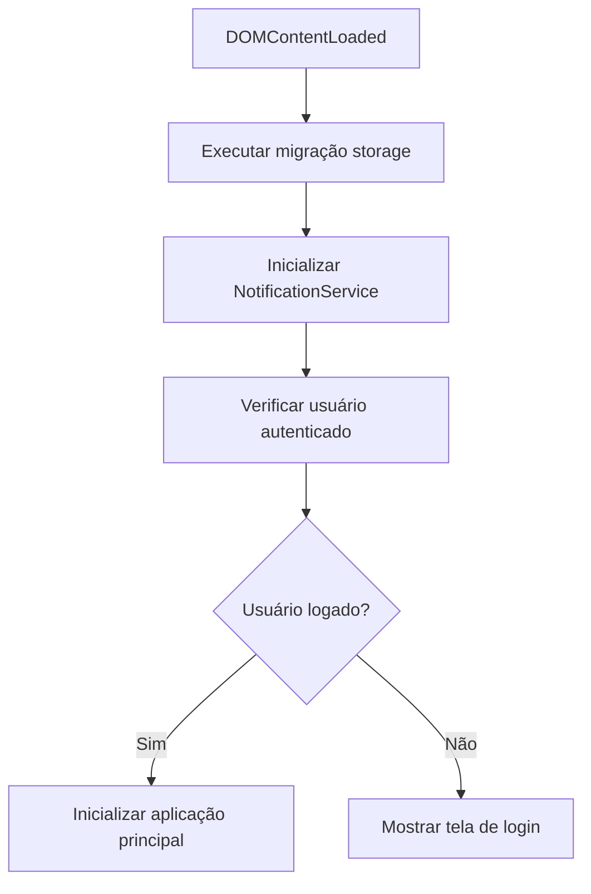

# Implementação da Tela de Login

## Visão Geral

Foi implementado um sistema completo de autenticação para o Sistema de Eleição de Oficiais de Igrejas, com tela de login profissional e integração preparada para Firebase Authentication.

## Funcionalidades Implementadas

### ✅ Tela de Login

- **Design consistente** com o sistema existente (Material Design 3, Inter font, dark mode)
- **Formulário responsivo** com validação em tempo real
- **Toggle de visibilidade da senha** com ícones do Material Icons
- **Estados de loading** com spinner animado
- **Feedback visual** para campos inválidos
- **Suporte completo ao modo escuro**

### ✅ Sistema de Autenticação Mock

- **Credenciais de teste** para desenvolvimento:
  - `admin@igreja.com` / `admin123` (Administrador)
  - `moderador@igreja.com` / `mod123` (Moderador)
  - `usuario@igreja.com` / `user123` (Usuário)
- **Persistência de sessão** via localStorage
- **Estado reativo** com sistema de subscribers
- **Controle de permissões** baseado em roles

### ✅ Integração com Fluxo da Aplicação

- **Verificação automática** de autenticação na inicialização
- **Roteamento condicional** (login vs aplicação principal)
- **Transições suaves** entre telas
- **Logout funcional** (preparado para implementação)

## Arquitetura

### Estrutura de Arquivos

```
src/
├── types/
│   └── auth.ts              # Tipos TypeScript para autenticação
├── modules/
│   └── auth/
│       ├── manager.ts       # AuthManager (lógica de negócio)
│       └── ui.ts           # LoginUI (interface do usuário)
└── main.ts                  # Ponto de entrada com fluxo de auth
```

### Componentes Principais

#### AuthManager

- **Singleton pattern** para estado global
- **Métodos principais:**
  - `login(credentials)` - Autenticação
  - `logout()` - Encerrar sessão
  - `getCurrentUser()` - Usuário atual
  - `hasRole(role)` - Verificar permissões
- **Estado reativo** com listeners

#### LoginUI

- **Componente de interface** para tela de login
- **Validação em tempo real** de email e senha
- **Gerenciamento de estados** (loading, erro, sucesso)
- **Event listeners** para interações do usuário

#### Tipos TypeScript

```typescript
interface User {
  uid: string;
  email: string;
  displayName: string;
  emailVerified: boolean;
  role: UserRole;
  createdAt: Date;
  lastLoginAt: Date;
}

enum UserRole {
  ADMIN = "admin",
  MODERATOR = "moderator",
  USER = "user",
}
```

## Fluxo de Funcionamento

### 1. Inicialização da Aplicação



### 2. Processo de Login

```mermaid
graph TD
    A[Usuário preenche formulário] --> B[Clicar em 'Entrar']
    B --> C[Validar campos]
    C --> D{Validação OK?}
    D -->|Não| E[Mostrar erros de validação]
    D -->|Sim| F[Mostrar loading]
    F --> G[Chamar AuthManager.login()]
    G --> H{Login bem-sucedido?}
    H -->|Sim| I[Esconder tela de login]
    H -->|Não| J[Mostrar erro]
    I --> K[Inicializar aplicação principal]
    J --> L[Resetar loading]
```

## Próximos Passos

### 🔄 Integração com Firebase Authentication

1. **Instalar Firebase SDK**
2. **Configurar projeto Firebase**
3. **Substituir AuthManager.login()** por Firebase Auth
4. **Implementar recuperação de senha**
5. **Adicionar autenticação social** (Google, etc.)

### 🔄 Funcionalidades Avançadas

1. **Sistema de registro** de novos usuários
2. **Verificação de email**
3. **Reset de senha**
4. **Sessões persistentes** com refresh tokens
5. **Multi-factor authentication**

### 🔄 Melhorias de UX

1. **Lembrar-me** (persistir login)
2. **Auto-login** após registro
3. **Transições animadas** entre telas
4. **Feedback tátil** em dispositivos móveis

## Como Testar

### Credenciais de Teste

```bash
# Administrador (acesso total)
Email: admin@igreja.com
Senha: admin123

# Moderador (acesso limitado)
Email: moderador@igreja.com
Senha: mod123

# Usuário comum (acesso básico)
Email: usuario@igreja.com
Senha: user123
```

### Passos para Teste

1. **Acessar aplicação** no navegador
2. **Verificar tela de login** aparece automaticamente
3. **Tentar login** com credenciais inválidas (deve mostrar erro)
4. **Fazer login** com credenciais válidas
5. **Verificar** que aplicação principal carrega
6. **Recarregar página** - deve manter sessão
7. **Limpar localStorage** - deve voltar para login

## Considerações Técnicas

### Segurança

- **Validação client-side** (complementar com server-side)
- **Sanitização de inputs** para prevenir XSS
- **HTTPS obrigatório** em produção
- **Tokens seguros** com Firebase Auth

### Performance

- **Lazy loading** dos módulos de auth
- **Cache inteligente** do estado de autenticação
- **Debounce** na validação de campos
- **Transições otimizadas** CSS

### Acessibilidade

- **Semântica HTML** correta (form, labels)
- **Navegação por teclado** completa
- **Screen readers** suportados
- **Contraste adequado** em todos os temas

## Logs e Debugging

### Console Logs

```
[Main] Usuário não autenticado - mostrando tela de login
[Main] Usuário autenticado: admin@igreja.com
[Main] ✓ Sistema inicializado com sucesso!
```

### Estados de Debug

- **Auth State**: `AuthManager.getInstance().getState()`
- **Current User**: `AuthManager.getInstance().getCurrentUser()`
- **Permissions**: `AuthManager.getInstance().hasRole(UserRole.ADMIN)`

---

**Status**: ✅ Implementado e funcional
**Data**: Janeiro 2025
**Próxima Fase**: Integração com Firebase Authentication</content>
<parameter name="filePath">c:\Users\Filipe Honório\Documents\church-seo\docs\IMPLEMENTACAO-TELA-LOGIN.md
