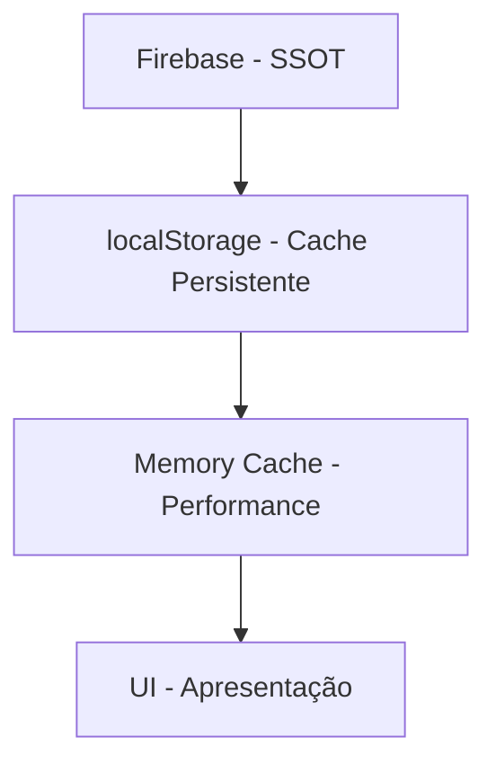

# Padrão Firebase + localStorage: Single Source of Truth

> 📅 **Criado**: 13 de outubro de 2025  
> 🎯 **Objetivo**: Documentar o padrão de uso de Firebase (SSOT) + localStorage (cache)  
> 🔧 **Status**: ✅ Implementado e validado

---

## 📋 Índice

1. [Visão Geral](#visão-geral)
2. [Arquitetura de 3 Camadas](#arquitetura-de-3-camadas)
3. [Padrões de Leitura](#padrões-de-leitura)
4. [Padrões de Escrita](#padrões-de-escrita)
5. [Casos de Uso](#casos-de-uso)
6. [Anti-Patterns (Evitar)](#anti-patterns-evitar)
7. [Checklist de Implementação](#checklist-de-implementação)

---

## 🎯 Visão Geral

### Princípio Fundamental

```
Firebase Realtime Database = SSOT (Single Source of Truth)
localStorage = Cache Write-Through
Memory Cache = Performance Layer
```

### Hierarquia de Dados



---

## 🏗️ Arquitetura de 3 Camadas

### 1️⃣ Firebase (SSOT)

**Papel**: Fonte única da verdade, sincronização multi-dispositivo

**Características**:

- ✅ Dados autoritativos
- ✅ Sincronização em tempo real
- ✅ Persistência na nuvem
- ✅ Histórico de atualizações

**Quando usar**:

- Escrita de novos dados
- Sincronização entre dispositivos
- Cold start (primeira carga)

**Estrutura**:

```json
{
  "members": {
    "data": [...],
    "updatedBy": "session-xxx",
    "timestamp": 1234567890
  },
  "config": {
    "data": { "quorum": {...} },
    "updatedBy": "session-xxx",
    "timestamp": 1234567890
  }
}
```

---

### 2️⃣ localStorage (Cache Persistente)

**Papel**: Cache write-through do Firebase, sobrevive a recargas de página

**Características**:

- ✅ Persistência local (sobrevive refresh)
- ✅ Acesso síncrono (performance)
- ✅ Backup durante cold start
- ❌ Não sincroniza entre dispositivos

**Quando usar**:

- **Leitura**: Sempre (read-through cache)
- **Escrita**: Apenas junto com Firebase (write-through)
- **Cold Start**: Hidratar com dados do Firebase se vazio

**Estrutura**:

```javascript
// StorageKeys.MEMBERS
localStorage.setItem("MEMBERS", JSON.stringify([...]));

// StorageKeys.CONFIG
localStorage.setItem("CONFIG", JSON.stringify({ quorum: {...} }));

// UI State (separado)
localStorage.setItem("darkMode", "true");
```

---

### 3️⃣ Memory Cache (Performance Layer)

**Papel**: Cache em memória para leituras ultra-rápidas

**Características**:

- ✅ Acesso instantâneo
- ✅ Zero latência
- ❌ Perdido ao recarregar página

**Quando usar**:

- Leituras frequentes (getMembers, getQuorumConfig)
- Lista de candidatos filtrada
- Contadores de presença

**Implementação**:

```typescript
private cache = new Map<string, any>();

// Leitura
const cached = this.cache.get("all-members");
if (cached) return cached;

// Escrita
this.cache.set("all-members", members);
```

---

## 📖 Padrões de Leitura

### ✅ Padrão Correto: Read-Through Cache

```typescript
async getMembers(): Promise<Member[]> {
  // 1️⃣ Memory cache (mais rápido)
  const cached = this.cache.get("all-members");
  if (cached) return cached;

  // 2️⃣ localStorage (cache do Firebase)
  const stored = localStorage.getItem(StorageKeys.MEMBERS);
  const members = stored ? JSON.parse(stored) : [];

  // 3️⃣ Atualizar memory cache
  this.cache.set("all-members", members);

  return members;
}
```

### ❌ Anti-Pattern: Ler apenas do Firebase

```typescript
// ❌ ERRADO: Muito lento, causa latência
async getMembers(): Promise<Member[]> {
  const snapshot = await get(ref(database, "members"));
  return snapshot.val().data;
}
```

**Por quê?**

- Firebase tem latência de rede (~100-500ms)
- Cada leitura faz requisição HTTP
- UI fica travada esperando dados

---

## ✍️ Padrões de Escrita

### ✅ Padrão Correto: Write-Through Cache

```typescript
private async saveMembers(members: Member[]): Promise<void> {
  // 1️⃣ Memory cache (UI imediata)
  this.cache.set("all-members", members);

  // 2️⃣ localStorage (cache persistente)
  localStorage.setItem(StorageKeys.MEMBERS, JSON.stringify(members));

  // 3️⃣ Firebase (SSOT + sincronização)
  RealtimeSync.getInstance().syncMembers(members);
}
```

**Ordem de Execução**:

1. Memory cache → UI atualiza instantaneamente
2. localStorage → Sobrevive a refresh
3. Firebase → Sincroniza com outros dispositivos

---

### ✅ Padrão Correto: Listeners de Sincronização

```typescript
// Firebase notifica mudanças remotas
this.eventSystem.on(EventTypes.SYNC_MEMBERS_UPDATED, (data: Member[]) => {
  // ✅ Atualizar cache localStorage
  localStorage.setItem(StorageKeys.MEMBERS, JSON.stringify(data));

  // ✅ Recarregar managers (eles leem do cache)
  this.memberManager.loadFromStorage();
  this.attendanceManager.loadFromStorage();
});
```

**Fluxo**:

```
Dispositivo A: Edita membro → Firebase atualiza
↓
Firebase: Notifica Dispositivo B via listener
↓
Dispositivo B: Recebe data → Atualiza localStorage → Recarrega UI
```

---

### ❌ Anti-Pattern: Escrita Isolada

```typescript
// ❌ ERRADO: Não sincroniza com Firebase
private async saveMembers(members: Member[]): Promise<void> {
  localStorage.setItem(StorageKeys.MEMBERS, JSON.stringify(members));
  // ❌ Faltou: RealtimeSync.syncMembers(members)
}
```

**Problema**: Dados ficam apenas locais, não sincronizam entre dispositivos.

---

### ❌ Anti-Pattern: Escrita Redundante em Listeners

```typescript
// ❌ ERRADO: Listener não deve escrever no Firebase
this.eventSystem.on(EventTypes.SYNC_MEMBERS_UPDATED, (data: Member[]) => {
  localStorage.setItem(StorageKeys.MEMBERS, JSON.stringify(data));

  // ❌ NÃO fazer: RealtimeSync.syncMembers(data)
  // Causa loop infinito!
});
```

**Problema**: Listener recebe dados do Firebase, não deve escrever de volta.

---

## 📚 Casos de Uso

### 1️⃣ Cold Start (Primeira Carga)

```typescript
private async loadFromFirebaseIfEmpty(): Promise<void> {
  const hasMembers = localStorage.getItem(StorageKeys.MEMBERS);

  if (!hasMembers || hasMembers === "[]") {
    // ✅ localStorage vazio → carregar do Firebase (SSOT)
    const firebaseData = await RealtimeSync.getInstance().loadInitialState();

    if (firebaseData.members) {
      // ✅ Hidratar cache localStorage
      localStorage.setItem(StorageKeys.MEMBERS, JSON.stringify(firebaseData.members));

      // ✅ Carregar managers
      await this.memberManager.loadFromStorage();
    }
  }
}
```

---

### 2️⃣ Adicionar Novo Membro

```typescript
async addMember(memberData: Omit<Member, "id">): Promise<AsyncResult<Member>> {
  const members = await this.getMembers(); // Lê do cache

  const newMember: Member = {
    ...memberData,
    id: generateId(),
  };

  members.push(newMember);

  // ✅ Write-through: Memory + localStorage + Firebase
  await this.saveMembers(members);

  return { success: true, data: newMember };
}
```

---

### 3️⃣ Editar Membro

```typescript
async updateMember(id: string, updates: Partial<Member>): Promise<AsyncResult<Member>> {
  const members = await this.getMembers(); // Lê do cache
  const index = members.findIndex(m => m.id === id);

  if (index === -1) {
    return { success: false, error: "Membro não encontrado" };
  }

  members[index] = { ...members[index], ...updates };

  // ✅ Write-through: Memory + localStorage + Firebase
  await this.saveMembers(members);

  return { success: true, data: members[index] };
}
```

---

### 4️⃣ Sincronização Multi-Dispositivo

**Dispositivo A**: Marca presença de João

```typescript
member.presente = true;
await this.saveMembers(members); // → Firebase atualiza
```

**Firebase**: Notifica Dispositivo B

```
onValue(membersRef, (snapshot) => {
  const data = snapshot.val();
  eventSystem.emit(EventTypes.SYNC_MEMBERS_UPDATED, data.data);
});
```

**Dispositivo B**: Recebe atualização

```typescript
eventSystem.on(EventTypes.SYNC_MEMBERS_UPDATED, (data: Member[]) => {
  localStorage.setItem(StorageKeys.MEMBERS, JSON.stringify(data));
  this.memberManager.loadFromStorage(); // UI atualiza
});
```

---

## 🚫 Anti-Patterns (Evitar)

### ❌ 1. localStorage como Fonte Primária

```typescript
// ❌ ERRADO
async addMember(member: Member): Promise<void> {
  const members = JSON.parse(localStorage.getItem("MEMBERS") || "[]");
  members.push(member);
  localStorage.setItem("MEMBERS", JSON.stringify(members));
  // ❌ Não sincroniza com Firebase!
}
```

**Correto**:

```typescript
// ✅ CORRETO
async addMember(member: Member): Promise<void> {
  const members = await this.getMembers();
  members.push(member);
  await this.saveMembers(members); // Sincroniza Firebase + localStorage
}
```

---

### ❌ 2. Leitura Direta do Firebase em Loops

```typescript
// ❌ ERRADO: Muito lento!
for (const memberId of memberIds) {
  const snapshot = await get(ref(database, `members/${memberId}`));
  const member = snapshot.val();
  // Processamento...
}
```

**Correto**:

```typescript
// ✅ CORRETO: Uma leitura do cache
const members = await this.getMembers(); // Cache
for (const memberId of memberIds) {
  const member = members.find((m) => m.id === memberId);
  // Processamento...
}
```

---

### ❌ 3. Escrita Sem Sincronização

```typescript
// ❌ ERRADO
function togglePresenca(memberId: string): void {
  const members = JSON.parse(localStorage.getItem("MEMBERS"));
  const member = members.find((m) => m.id === memberId);
  member.presente = !member.presente;
  localStorage.setItem("MEMBERS", JSON.stringify(members));
  // ❌ Não sincroniza com Firebase!
}
```

**Correto**:

```typescript
// ✅ CORRETO
async togglePresenca(memberId: string): Promise<void> {
  const members = await this.getMembers();
  const member = members.find(m => m.id === memberId);
  member.presente = !member.presente;
  await this.saveMembers(members); // Sincroniza tudo
}
```

---

### ❌ 4. Listeners Escrevendo no Firebase

```typescript
// ❌ ERRADO: Loop infinito!
onValue(membersRef, (snapshot) => {
  const data = snapshot.val().data;
  localStorage.setItem("MEMBERS", JSON.stringify(data));
  RealtimeSync.getInstance().syncMembers(data); // ❌ LOOP!
});
```

**Correto**:

```typescript
// ✅ CORRETO: Apenas atualizar cache
onValue(membersRef, (snapshot) => {
  const data = snapshot.val().data;
  if (data.updatedBy !== this.sessionId) {
    // Ignorar próprias mudanças
    localStorage.setItem("MEMBERS", JSON.stringify(data));
    this.memberManager.loadFromStorage(); // Apenas recarregar
  }
});
```

---

## ✅ Checklist de Implementação

### Leitura (GET)

- [ ] Verificar memory cache primeiro
- [ ] Fallback para localStorage
- [ ] Atualizar memory cache após leitura
- [ ] Validar dados antes de parse JSON
- [ ] Tratar erros com fallback vazio

### Escrita (SET)

- [ ] Atualizar memory cache
- [ ] Atualizar localStorage
- [ ] Sincronizar com Firebase
- [ ] Emitir evento de atualização
- [ ] Validar dados antes de salvar

### Sincronização

- [ ] Listener ignora próprias mudanças (sessionId)
- [ ] Listener atualiza apenas localStorage
- [ ] Listener NÃO escreve no Firebase
- [ ] Listener recarrega managers
- [ ] Listener emite eventos de UI

### Cold Start

- [ ] Verificar se localStorage está vazio
- [ ] Carregar do Firebase se necessário
- [ ] Hidratar localStorage com dados do Firebase
- [ ] Recarregar todos os managers
- [ ] Emitir eventos de carga concluída

---

## 📊 Comparação de Performance

| Operação      | Memory Cache | localStorage | Firebase      |
| ------------- | ------------ | ------------ | ------------- |
| Leitura       | ~0.1ms       | ~1ms         | ~100-500ms    |
| Escrita       | ~0.1ms       | ~5ms         | ~200-800ms    |
| Persistência  | ❌ Não       | ✅ Página    | ✅ Nuvem      |
| Sincronização | ❌ Não       | ❌ Não       | ✅ Sim        |
| Limite        | RAM          | ~5-10MB      | ~1GB gratuito |

---

## 🎯 Resumo Executivo

### Padrão de Leitura

```
Memory Cache → localStorage (cache) → Firebase (cold start)
```

### Padrão de Escrita

```
Memory Cache + localStorage + Firebase (write-through)
```

### Padrão de Sincronização

```
Firebase → Listener → localStorage → loadFromStorage() → UI
```

---

## 📚 Arquivos Relacionados

- `src/utils/realtime-sync.ts` - Sistema de sincronização Firebase
- `src/modules/members.ts` - Padrão de cache em getMembers/saveMembers
- `src/modules/voting.ts` - Padrão de cache em config
- `src/app.ts` - Listeners e cold start
- `docs/IMPLEMENTACAO-FIREBASE-CONCLUIDA.md` - Referência completa Firebase

---

✅ **Padrão validado e documentado em 13/out/2025**
